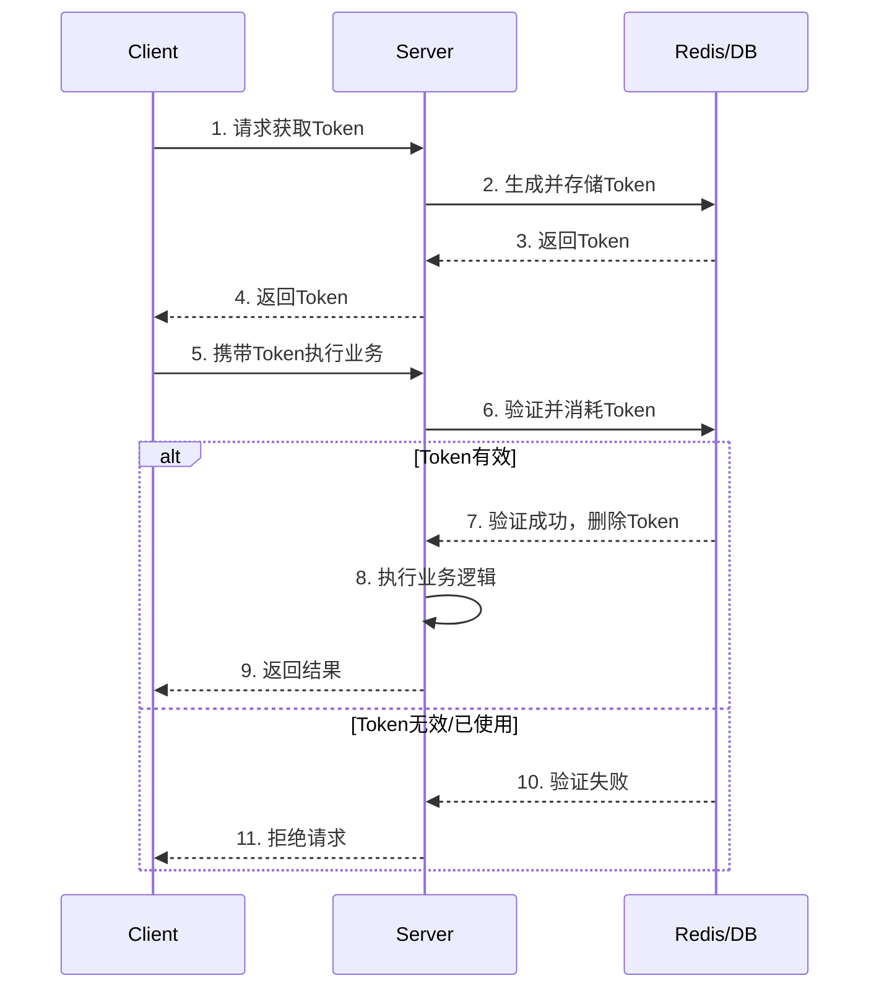
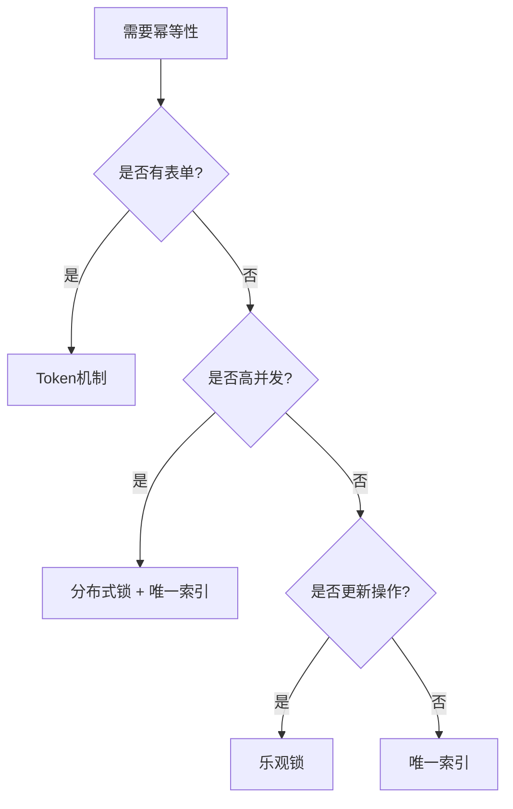

# Token机制 - 基础概念与设计

## 目录
- [1. 概述](#1-概述)
- [2. Token 的核心原理](#2-token-的核心原理)
- [3. Token 的生命周期](#3-token-的生命周期)
- [4. Token vs 其他幂等方案](#4-token-vs-其他幂等方案)
- [5. C# 基础实现](#5-c-基础实现)
- [6. 最佳实践](#6-最佳实践)

---

## 1. 概述

### 1.1 什么是 Token 机制？

Token 机制是实现幂等性的**最经典、最直观**的方案之一。其核心思想是：在执行重要操作前，先生成一个唯一的令牌（Token），客户端必须携带这个令牌才能执行操作，服务端通过验证令牌的有效性来防止重复执行。

**类比现实**：
- **医院挂号单**：先取号（获取Token），凭号就诊（使用Token）
- **餐厅排队**：先拿号（获取Token），叫号入座（使用Token）
- **演唱会门票**：一票一人，验票入场（Token一次性使用）

### 1.2 核心流程



### 1.3 适用场景

| 场景 | 说明 | 示例 |
|------|------|------|
| **表单提交** | 防止用户重复点击提交按钮 | 订单创建、信息修改 |
| **支付操作** | 防止重复扣款 | 充值、转账 |
| **文件上传** | 防止重复上传 | 头像、文档 |
| **敏感操作** | 防止误操作多次执行 | 删除账号、修改密码 |

---

## 2. Token 的核心原理

### 2.1 Token 的本质

Token 本质上是一个**唯一标识符**，用于标记某次特定的操作请求。

**关键特性**：
1. **唯一性**：每个Token全局唯一
2. **一次性**：使用后立即失效
3. **时效性**：有过期时间，避免长期占用存储
4. **不可预测**：防止恶意猜测

### 2.2 Token 的两种模式

#### 模式1：预生成模式（Pull模式）

客户端先请求Token，再使用Token执行业务。

```
步骤1: GET /api/token → 返回 "token_abc123"
步骤2: POST /api/orders { token: "token_abc123", ... }
```

**优点**：
- 简单直观
- 客户端可控
- 适用于表单场景

**缺点**：
- 需要两次请求
- Token可能被截获重用

#### 模式2：同步锁模式（Push模式）

客户端直接执行业务，服务端基于业务特征生成Token并加锁。

```
POST /api/orders { orderNo: "ORD001", ... }
→ 服务端基于 orderNo 生成 Token 并加锁
```

**优点**：
- 一次请求完成
- 性能更好

**缺点**：
- 实现复杂
- 需要定义Token生成规则

---

## 3. Token 的生命周期

### 3.1 完整生命周期

```
生成 → 存储 → 分发 → 验证 → 消耗 → 清理
```

**详细说明**：

1. **生成（Generate）**
   ```csharp
   var token = Guid.NewGuid().ToString("N");
   // 或
   var token = Convert.ToHexString(RandomNumberGenerator.GetBytes(16));
   ```

2. **存储（Store）**
   ```csharp
   await redis.StringSetAsync($"token:{token}", "pending", TimeSpan.FromMinutes(10));
   ```

3. **分发（Distribute）**
   ```csharp
   return Ok(new { token });
   ```

4. **验证（Validate）**
   ```csharp
   var status = await redis.StringGetAsync($"token:{token}");
   if (status != "pending") {
       throw new InvalidOperationException("Invalid token");
   }
   ```

5. **消耗（Consume）**
   ```csharp
   // 原子操作：检查并删除
   var deleted = await redis.StringGetDeleteAsync($"token:{token}");
   ```

6. **清理（Cleanup）**
   ```csharp
   // Redis 自动过期
   // 或定时任务清理数据库中的过期Token
   ```

### 3.2 异常处理

**场景1：Token未使用就过期**
```
用户获取Token后关闭页面，Token在Redis中自动过期清理
```

**场景2：Token验证失败**
```
用户使用已消耗的Token再次请求 → 返回 409 Conflict
```

**场景3：并发使用同一Token**
```
两个请求同时使用同一Token → Redis原子操作保证只有一个成功
```

---

## 4. Token vs 其他幂等方案

### 4.1 方案对比

| 方案 | 优点 | 缺点 | 适用场景 |
|------|------|------|---------|
| **Token机制** | 简单直观，前端友好 | 需额外请求，有存储成本 | 表单提交、用户操作 |
| **唯一索引** | 数据库保证，无需额外逻辑 | 依赖数据库，错误处理复杂 | 订单创建、用户注册 |
| **乐观锁** | 无阻塞，性能好 | 可能失败重试 | 低冲突的更新操作 |
| **分布式锁** | 强一致性 | 性能开销大 | 高并发库存扣减 |
| **请求ID** | 客户端控制，灵活 | 需客户端配合 | API调用、消息队列 |

### 4.2 选择建议



---

## 5. C# 基础实现

### 5.1 Token 服务接口

```csharp
namespace Idempotency.Token.Core
{
    public interface ITokenService
    {
        /// <summary>
        /// 生成Token
        /// </summary>
        Task<string> GenerateAsync(TimeSpan? expiry = null);
        
        /// <summary>
        /// 验证并消耗Token（原子操作）
        /// </summary>
        Task<bool> ValidateAndConsumeAsync(string token);
        
        /// <summary>
        /// 检查Token是否有效
        /// </summary>
        Task<bool> IsValidAsync(string token);
    }
}
```

### 5.2 基于 Redis 的实现

```csharp
using StackExchange.Redis;

namespace Idempotency.Token.Services
{
    public class RedisTokenService : ITokenService
    {
        private readonly IDatabase _redis;
        private readonly ILogger<RedisTokenService> _logger;
        
        public RedisTokenService(
            IConnectionMultiplexer redis,
            ILogger<RedisTokenService> logger)
        {
            _redis = redis.GetDatabase();
            _logger = logger;
        }
        
        /// <summary>
        /// 生成Token
        /// </summary>
        public async Task<string> GenerateAsync(TimeSpan? expiry = null)
        {
            // 生成唯一Token
            var token = Guid.NewGuid().ToString("N");
            var key = $"token:{token}";
            
            // 存储到Redis，设置过期时间
            var ttl = expiry ?? TimeSpan.FromMinutes(10);
            await _redis.StringSetAsync(key, "pending", ttl);
            
            _logger.LogDebug("Token generated: {Token}, TTL: {TTL}s", token, ttl.TotalSeconds);
            
            return token;
        }
        
        /// <summary>
        /// 验证并消耗Token（原子操作）
        /// </summary>
        public async Task<bool> ValidateAndConsumeAsync(string token)
        {
            var key = $"token:{token}";
            
            try
            {
                // 原子操作：获取并删除
                var value = await _redis.StringGetDeleteAsync(key);
                
                if (value.HasValue && value == "pending")
                {
                    _logger.LogDebug("Token validated and consumed: {Token}", token);
                    return true;
                }
                
                _logger.LogWarning("Invalid or already used token: {Token}", token);
                return false;
            }
            catch (Exception ex)
            {
                _logger.LogError(ex, "Error validating token: {Token}", token);
                return false;
            }
        }
        
        /// <summary>
        /// 检查Token是否有效
        /// </summary>
        public async Task<bool> IsValidAsync(string token)
        {
            var key = $"token:{token}";
            var exists = await _redis.KeyExistsAsync(key);
            return exists;
        }
    }
}
```

### 5.3 ASP.NET Core 中间件

```csharp
namespace Idempotency.Token.Middleware
{
    public class TokenValidationMiddleware
    {
        private readonly RequestDelegate _next;
        private readonly ITokenService _tokenService;
        
        public TokenValidationMiddleware(
            RequestDelegate next,
            ITokenService tokenService)
        {
            _next = next;
            _tokenService = tokenService;
        }
        
        public async Task InvokeAsync(HttpContext context)
        {
            // 从Header中提取Token
            if (!context.Request.Headers.TryGetValue("X-Idempotency-Token", out var tokenHeader))
            {
                context.Response.StatusCode = StatusCodes.Status400BadRequest;
                await context.Response.WriteAsync("Missing X-Idempotency-Token header");
                return;
            }
            
            var token = tokenHeader.ToString();
            
            // 验证并消耗Token
            var isValid = await _tokenService.ValidateAndConsumeAsync(token);
            
            if (!isValid)
            {
                context.Response.StatusCode = StatusCodes.Status409Conflict;
                await context.Response.WriteAsync("Invalid or expired token");
                return;
            }
            
            // Token有效，继续处理
            await _next(context);
        }
    }
}
```

### 5.4 注册服务

```csharp
// Program.cs
builder.Services.AddSingleton<IConnectionMultiplexer>(sp =>
{
    var config = builder.Configuration.GetConnectionString("Redis");
    return ConnectionMultiplexer.Connect(config);
});

builder.Services.AddScoped<ITokenService, RedisTokenService>();

var app = builder.Build();

// 对特定路由使用Token验证
app.MapPost("/api/orders", async (HttpContext context) =>
{
    // 业务逻辑
})
.RequireAuthorization()
.AddEndpointFilter(async (context, next) =>
{
    var tokenService = context.HttpContext.RequestServices
        .GetRequiredService<ITokenService>();
    
    var middleware = new TokenValidationMiddleware(next, tokenService);
    await middleware.InvokeAsync(context.HttpContext);
});

app.Run();
```

---

## 6. 最佳实践

### 6.1 Token 生成策略

```csharp
// ✅ 推荐：使用加密安全的随机数
var token = Convert.ToHexString(RandomNumberGenerator.GetBytes(16));

// ❌ 避免：使用时间戳（可预测）
var token = DateTime.UtcNow.Ticks.ToString();
```

### 6.2 合理的过期时间

```csharp
// 根据业务场景设置
var shortLivedToken = await GenerateAsync(TimeSpan.FromMinutes(5));  // 验证码
var normalToken = await GenerateAsync(TimeSpan.FromMinutes(30));     // 表单提交
var longLivedToken = await GenerateAsync(TimeSpan.FromHours(24));    // 文件上传
```

### 6.3 原子操作保证

```csharp
// ✅ 推荐：使用原子操作
var deleted = await redis.StringGetDeleteAsync(key);

// ❌ 避免：分两步操作（存在竞态条件）
var value = await redis.StringGetAsync(key);
await redis.KeyDeleteAsync(key);
```

### 6.4 监控Token使用

```csharp
public class TokenMetrics
{
    private readonly Counter<long> _tokensGenerated;
    private readonly Counter<long> _tokensValidated;
    private readonly Counter<long> _tokensRejected;
    
    public void RecordTokenGenerated()
    {
        _tokensGenerated.Add(1);
    }
    
    public void RecordTokenValidated(bool success)
    {
        if (success)
            _tokensValidated.Add(1);
        else
            _tokensRejected.Add(1);
    }
}
```

### 6.5 前端集成示例

```javascript
// 1. 获取Token
const response = await fetch('/api/token', { method: 'POST' });
const { token } = await response.json();

// 2. 使用Token提交表单
const submitResponse = await fetch('/api/orders', {
    method: 'POST',
    headers: {
        'Content-Type': 'application/json',
        'X-Idempotency-Token': token
    },
    body: JSON.stringify(orderData)
});

// 3. 禁用提交按钮防止重复点击
submitButton.disabled = true;
```

---

## 总结

Token机制是实现幂等性的基础方案，特别适合表单提交等用户交互场景：

### 核心要点

1. **预生成模式**：先获取Token，再执行业务
2. **一次性使用**：验证后立即删除
3. **原子操作**：使用Redis原子命令保证并发安全
4. **合理过期**：根据业务场景设置TTL

### 适用场景

- ✅ 表单提交（订单创建、信息修改）
- ✅ 支付操作（充值、转账）
- ✅ 文件上传
- ❌ 高频API调用（性能开销大）
- ❌ 消息队列消费（更适合请求ID）

Token机制简单直观，是入门幂等性设计的最佳起点。
