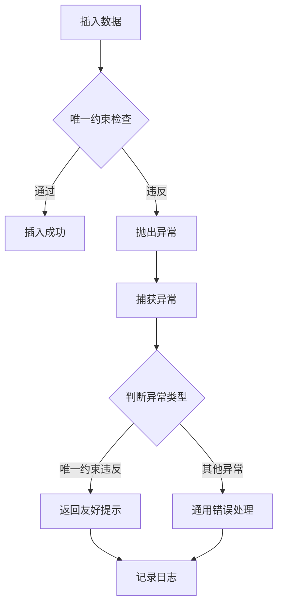

# 唯一索引 - 异常处理详解

## 目录
- [1. 概述](#1-概述)
- [2. 常见异常类型](#2-常见异常类型)
- [3. PostgreSQL 异常处理](#3-postgresql-异常处理)
- [4. MySQL 异常处理](#4-mysql-异常处理)
- [5. EF Core 异常处理](#5-ef-core-异常处理)
- [6. 优雅的错误响应](#6-优雅的错误响应)
- [7. 最佳实践](#7-最佳实践)

---

## 1. 概述

### 1.1 为什么需要异常处理？

当使用唯一索引实现幂等性时，重复请求会触发数据库的唯一约束违反异常。如果不正确处理这些异常，会导致：

- **用户体验差**：显示技术性错误信息
- **系统不稳定**：未捕获的异常可能导致服务崩溃
- **安全隐患**：暴露数据库结构信息
- **排查困难**：缺少详细的错误日志

### 1.2 异常处理流程



---

## 2. 常见异常类型

### 2.1 数据库异常分类

| 数据库 | 异常类 | SQL状态码 | 错误码 |
|--------|--------|----------|--------|
| **PostgreSQL** | NpgsqlException | 23505 | - |
| **MySQL** | MySqlException | - | 1062 |
| **SQL Server** | SqlException | - | 2627, 2601 |
| **SQLite** | SQLiteException | - | 19 |
| **Oracle** | OracleException | - | 1 |

### 2.2 EF Core 异常

```csharp
// DbUpdateException: 数据库更新异常（包装了底层数据库异常）
try
{
    await _dbContext.SaveChangesAsync();
}
catch (DbUpdateException ex)
{
    // 访问内部异常获取具体信息
    var innerEx = ex.InnerException;
}
```

---

## 3. PostgreSQL 异常处理

### 3.1 基础异常检测

```csharp
using Npgsql;

public class OrderService
{
    private readonly OrderDbContext _dbContext;
    
    public async Task<Result<long>> CreateOrderAsync(CreateOrderRequest request)
    {
        try
        {
            var order = new Order
            {
                OrderNo = GenerateOrderNo(),
                UserId = request.UserId,
                TotalAmount = request.TotalAmount
            };
            
            _dbContext.Orders.Add(order);
            await _dbContext.SaveChangesAsync();
            
            return Result.Success(order.Id);
        }
        catch (DbUpdateException ex) when (IsUniqueViolation(ex))
        {
            // 提取冲突的订单号
            var conflictInfo = ExtractConflictInfo(ex);
            
            return Result.Fail<long>(
                $"Order already exists: {conflictInfo.ConstrainedValue}");
        }
    }
    
    /// <summary>
    /// 判断是否为唯一约束违反
    /// </summary>
    private bool IsUniqueViolation(DbUpdateException ex)
    {
        if (ex.InnerException is NpgsqlException npgEx)
        {
            // SQL状态码 23505: unique_violation
            return npgEx.SqlState == "23505";
        }
        return false;
    }
    
    /// <summary>
    /// 提取冲突信息
    /// </summary>
    private ConflictInfo ExtractConflictInfo(DbUpdateException ex)
    {
        var npgEx = ex.InnerException as NpgsqlException;
        
        // 从错误消息中提取信息
        // 示例消息: "duplicate key value violates unique constraint \"uk_orders_orderno\""
        var message = npgEx?.Message ?? "";
        
        var match = Regex.Match(message, @"Key \(([^)]+)\)=\(([^)]+)\)");
        if (match.Success)
        {
            return new ConflictInfo
            {
                ColumnName = match.Groups[1].Value,
                ConstrainedValue = match.Groups[2].Value
            };
        }
        
        return new ConflictInfo
        {
            ColumnName = "unknown",
            ConstrainedValue = "unknown"
        };
    }
}

public record ConflictInfo(string ColumnName, string ConstrainedValue);
```

### 3.2 高级异常处理

```csharp
public class AdvancedPostgresExceptionHandler
{
    private readonly ILogger<AdvancedPostgresExceptionHandler> _logger;
    
    public async Task<T> ExecuteWithHandlingAsync<T>(
        Func<Task<T>> operation,
        Dictionary<string, string> customMessages)
    {
        try
        {
            return await operation();
        }
        catch (DbUpdateException ex) when (IsUniqueViolation(ex))
        {
            var conflictInfo = ExtractConflictInfo(ex);
            
            // 查找自定义错误消息
            var errorMessage = customMessages.TryGetValue(conflictInfo.ColumnName, out var msg)
                ? msg
                : $"Duplicate value for {conflictInfo.ColumnName}";
            
            _logger.LogWarning(ex, 
                "Unique constraint violation on column {Column}, value {Value}",
                conflictInfo.ColumnName, conflictInfo.ConstrainedValue);
            
            throw new BusinessRuleViolationException(errorMessage, conflictInfo);
        }
        catch (DbUpdateConcurrencyException ex)
        {
            _logger.LogError(ex, "Concurrency conflict detected");
            throw new ConcurrencyException("Data was modified by another user", ex);
        }
        catch (NpgsqlException ex) when (ex.SqlState == "23503")
        {
            // 外键约束违反
            _logger.LogError(ex, "Foreign key constraint violation");
            throw new ReferentialIntegrityException("Referenced record not found", ex);
        }
        catch (NpgsqlException ex) when (ex.SqlState == "23502")
        {
            // NOT NULL 约束违反
            _logger.LogError(ex, "NOT NULL constraint violation");
            throw new ValidationException("Required field is missing", ex);
        }
    }
}

// 自定义异常
public class BusinessRuleViolationException : Exception
{
    public ConflictInfo ConflictInfo { get; }
    
    public BusinessRuleViolationException(string message, ConflictInfo conflictInfo) 
        : base(message)
    {
        ConflictInfo = conflictInfo;
    }
}

public class ConcurrencyException : Exception
{
    public ConcurrencyException(string message, Exception inner) 
        : base(message, inner) { }
}

public class ReferentialIntegrityException : Exception
{
    public ReferentialIntegrityException(string message, Exception inner) 
        : base(message, inner) { }
}

public class ValidationException : Exception
{
    public ValidationException(string message, Exception inner) 
        : base(message, inner) { }
}
```

---

## 4. MySQL 异常处理

### 4.1 基础异常检测

```csharp
using MySqlConnector;

public class MySqlOrderService
{
    private readonly OrderDbContext _dbContext;
    
    public async Task<Result<long>> CreateOrderAsync(CreateOrderRequest request)
    {
        try
        {
            var order = new Order
            {
                OrderNo = GenerateOrderNo(),
                UserId = request.UserId,
                TotalAmount = request.TotalAmount
            };
            
            _dbContext.Orders.Add(order);
            await _dbContext.SaveChangesAsync();
            
            return Result.Success(order.Id);
        }
        catch (DbUpdateException ex) when (IsUniqueViolation(ex))
        {
            return Result.Fail<long>("Order number already exists");
        }
    }
    
    private bool IsUniqueViolation(DbUpdateException ex)
    {
        if (ex.InnerException is MySqlException mysqlEx)
        {
            // MySQL 错误码 1062: Duplicate entry
            return mysqlEx.Number == 1062;
        }
        return false;
    }
}
```

### 4.2 提取详细信息

```csharp
public class MySqlConflictExtractor
{
    public static ConflictInfo ExtractFromException(DbUpdateException ex)
    {
        var mysqlEx = ex.InnerException as MySqlException;
        if (mysqlEx == null)
        {
            return new ConflictInfo("unknown", "unknown");
        }
        
        // 错误消息示例: "Duplicate entry 'ORD001' for key 'uk_orders_orderno'"
        var match = Regex.Match(mysqlEx.Message, @"Duplicate entry '([^']+)' for key '([^']+)'");
        
        if (match.Success)
        {
            return new ConflictInfo(
                match.Groups[2].Value, // 索引名
                match.Groups[1].Value  // 冲突值
            );
        }
        
        return new ConflictInfo("unknown", mysqlEx.Message);
    }
}
```

---

## 5. EF Core 异常处理

### 5.1 全局异常处理中间件

```csharp
namespace Idempotency.Infrastructure.Middleware
{
    public class GlobalExceptionHandlingMiddleware
    {
        private readonly RequestDelegate _next;
        private readonly ILogger<GlobalExceptionHandlingMiddleware> _logger;
        
        public GlobalExceptionHandlingMiddleware(
            RequestDelegate next,
            ILogger<GlobalExceptionHandlingMiddleware> logger)
        {
            _next = next;
            _logger = logger;
        }
        
        public async Task InvokeAsync(HttpContext context)
        {
            try
            {
                await _next(context);
            }
            catch (BusinessRuleViolationException ex)
            {
                _logger.LogWarning(ex, "Business rule violated");
                
                context.Response.StatusCode = StatusCodes.Status409Conflict;
                context.Response.ContentType = "application/json";
                
                var response = new ErrorResponse
                {
                    Code = "CONFLICT",
                    Message = ex.Message,
                    Details = new
                    {
                        ex.ConflictInfo.ColumnName,
                        ex.ConflictInfo.ConstrainedValue
                    },
                    Timestamp = DateTime.UtcNow
                };
                
                await context.Response.WriteAsJsonAsync(response);
            }
            catch (ConcurrencyException ex)
            {
                _logger.LogWarning(ex, "Concurrency conflict");
                
                context.Response.StatusCode = StatusCodes.Status409Conflict;
                context.Response.ContentType = "application/json";
                
                var response = new ErrorResponse
                {
                    Code = "CONCURRENCY_CONFLICT",
                    Message = ex.Message,
                    Timestamp = DateTime.UtcNow
                };
                
                await context.Response.WriteAsJsonAsync(response);
            }
            catch (ValidationException ex)
            {
                _logger.LogWarning(ex, "Validation failed");
                
                context.Response.StatusCode = StatusCodes.Status400BadRequest;
                context.Response.ContentType = "application/json";
                
                var response = new ErrorResponse
                {
                    Code = "VALIDATION_ERROR",
                    Message = ex.Message,
                    Timestamp = DateTime.UtcNow
                };
                
                await context.Response.WriteAsJsonAsync(response);
            }
            catch (Exception ex)
            {
                _logger.LogError(ex, "Unhandled exception");
                
                context.Response.StatusCode = StatusCodes.Status500InternalServerError;
                context.Response.ContentType = "application/json";
                
                var response = new ErrorResponse
                {
                    Code = "INTERNAL_ERROR",
                    Message = "An unexpected error occurred",
                    Timestamp = DateTime.UtcNow
                };
                
#if DEBUG
                response.Details = new { ex.Message, ex.StackTrace };
#endif
                
                await context.Response.WriteAsJsonAsync(response);
            }
        }
    }
    
    public class ErrorResponse
    {
        public string Code { get; set; } = string.Empty;
        public string Message { get; set; } = string.Empty;
        public object? Details { get; set; }
        public DateTime Timestamp { get; set; }
    }
}
```

### 5.2 注册中间件

```csharp
// Program.cs
var app = builder.Build();

// 全局异常处理（放在最前面）
app.UseMiddleware<GlobalExceptionHandlingMiddleware>();

// 其他中间件...
app.UseAuthentication();
app.UseAuthorization();

app.MapControllers();
app.Run();
```

---

## 6. 优雅的错误响应

### 6.1 标准化的错误格式

```json
{
  "code": "UNIQUE_CONSTRAINT_VIOLATION",
  "message": "订单号已存在",
  "details": {
    "columnName": "order_no",
    "conflictingValue": "ORD20260408001"
  },
  "timestamp": "2026-04-08T12:34:56Z",
  "traceId": "00-1234567890abcdef-fedcba0987654321-01"
}
```

### 6.2 前端友好的错误代码

```csharp
public static class ErrorCodes
{
    // 唯一约束相关
    public const string UNIQUE_CONSTRAINT_VIOLATION = "UNIQUE_CONSTRAINT_VIOLATION";
    public const string DUPLICATE_ORDER = "DUPLICATE_ORDER";
    public const string DUPLICATE_USER = "DUPLICATE_USER";
    
    // 并发相关
    public const string CONCURRENCY_CONFLICT = "CONCURRENCY_CONFLICT";
    
    // 验证相关
    public const string VALIDATION_ERROR = "VALIDATION_ERROR";
}
```

### 6.3 多语言错误消息

```csharp
public class LocalizedErrorMessageProvider
{
    private readonly IStringLocalizer<ErrorResources> _localizer;
    
    public string GetUniqueViolationMessage(string columnName)
    {
        return columnName switch
        {
            "email" => _localizer["EmailAlreadyExists"],
            "username" => _localizer["UsernameAlreadyTaken"],
            "order_no" => _localizer["OrderNumberExists"],
            _ => _localizer["DefaultValue"]
        };
    }
}
```

---

## 7. 最佳实践

### 7.1 日志记录

```csharp
// ✅ 推荐：结构化日志
_logger.LogWarning(
    "Unique constraint violation: Column={Column}, Value={Value}, UserId={UserId}",
    conflictInfo.ColumnName,
    conflictInfo.ConstrainedValue,
    userId);

// ❌ 避免：字符串拼接
_logger.LogWarning("Error: " + ex.Message);
```

### 7.2 异常过滤

```csharp
// ✅ 推荐：精确捕获
catch (DbUpdateException ex) when (IsUniqueViolation(ex))
{
    // 处理唯一约束违反
}

// ❌ 避免：捕获所有异常
catch (Exception ex)
{
    // 太宽泛
}
```

### 7.3 用户提示

```csharp
// ✅ 推荐：友好提示
return Result.Fail("该邮箱已被注册，请使用其他邮箱或直接登录");

// ❌ 避免：技术术语
return Result.Fail("violates unique constraint uk_users_email");
```

### 7.4 监控告警

```csharp
public class DatabaseExceptionMetrics
{
    private readonly Counter<long> _uniqueViolations;
    private readonly Counter<long> _concurrencyConflicts;
    
    public void RecordUniqueViolation(string tableName, string columnName)
    {
        _uniqueViolations.Add(1, 
            new KeyValuePair<string, string?>("table", tableName),
            new KeyValuePair<string, string?>("column", columnName));
    }
    
    public void RecordConcurrencyConflict()
    {
        _concurrencyConflicts.Add(1);
    }
}
```

### 7.5 重试策略

```csharp
// 对于并发冲突，可以实现自动重试
public class RetryOnConcurrencyService
{
    private readonly Polly.IAsyncPolicy _retryPolicy;
    
    public RetryOnConcurrencyService()
    {
        _retryPolicy = Policy
            .Handle<DbUpdateConcurrencyException>()
            .WaitAndRetryAsync(
                retryCount: 3,
                sleepDurationProvider: retryAttempt => 
                    TimeSpan.FromMilliseconds(Math.Pow(2, retryAttempt) * 100));
    }
    
    public async Task<T> ExecuteWithRetryAsync<T>(Func<Task<T>> operation)
    {
        return await _retryPolicy.ExecuteAsync(operation);
    }
}
```

---

## 总结

唯一索引的异常处理是保证系统稳定性和用户体验的关键：

### 核心要点

1. **精确捕获**：区分唯一约束违反和其他异常
2. **友好提示**：向用户展示清晰的错误信息
3. **详细日志**：记录足够的信息用于排查问题
4. **标准化响应**：统一的错误格式便于前端处理

### 最佳实践

- 使用 `when` 子句精确过滤异常
- 提取冲突信息用于个性化提示
- 实现全局异常处理中间件
- 监控异常频率，及时发现潜在问题

通过完善的异常处理，可以让幂等性设计更加健壮和易用。
