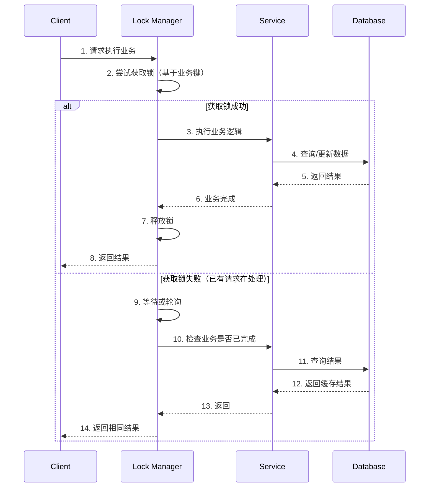

# Token机制 - 同步锁模式

## 目录
- [1. 概述](#1-概述)
- [2. 同步锁原理](#2-同步锁原理)
- [3. 内存锁实现](#3-内存锁实现)
- [4. 分布式锁实现](#4-分布式锁实现)
- [5. 双重检查锁定](#5-双重检查锁定)
- [6. 高性能优化](#6-高性能优化)
- [7. 最佳实践](#7-最佳实践)

---

## 1. 概述

### 1.1 什么是同步锁模式？

同步锁模式是 Token 机制的一种实现方式，通过**互斥锁**保证同一时间只有一个请求能执行关键操作，从而实现幂等性。

**核心思想**：
```
请求A → 获取锁 → 执行业务 → 释放锁
请求B → 等待锁 → 获取锁 → 检查是否已执行 → 直接返回结果
```

**适用场景**：
- 单机环境：使用内存锁（`lock`、`SemaphoreSlim`）
- 分布式环境：使用分布式锁（Redis、Zookeeper）
- 高并发场景：减少数据库压力

### 1.2 与其他模式的对比

| 模式 | 优点 | 缺点 | 适用场景 |
|------|------|------|---------|
| **Token预生成** | 简单直观 | 需要额外存储 | 表单提交 |
| **唯一索引** | 数据库保证 | 依赖数据库 | 订单创建 |
| **同步锁** | 性能好，实时 | 实现复杂 | 高并发接口 |
| **乐观锁** | 无阻塞 | 可能失败重试 | 低冲突场景 |

---

## 2. 同步锁原理

### 2.1 基本流程



### 2.2 锁的粒度

**粗粒度锁**：整个方法加锁
```csharp
lock (_globalLock)
{
    // 所有请求串行执行，性能差
    return ProcessOrder(request);
}
```

**细粒度锁**：基于业务键加锁（推荐）
```csharp
var lockKey = $"order_{request.OrderNo}";
using (await _lockManager.AcquireAsync(lockKey))
{
    // 只有相同订单号的请求会串行
    return ProcessOrder(request);
}
```

---

## 3. 内存锁实现

### 3.1 基于 `lock` 语句

```csharp
using System.Collections.Concurrent;

namespace Idempotency.Locking.InMemory
{
    /// <summary>
    /// 基于内存的细粒度锁管理器
    /// </summary>
    public class InMemoryLockManager : IDisposable
    {
        private readonly ConcurrentDictionary<string, object> _locks = new();
        private readonly ILogger<InMemoryLockManager> _logger;
        
        public InMemoryLockManager(ILogger<InMemoryLockManager> logger)
        {
            _logger = logger;
        }
        
        /// <summary>
        /// 执行同步操作（基于业务键）
        /// </summary>
        public T ExecuteWithLock<T>(string key, Func<T> action, TimeSpan? timeout = null)
        {
            var lockObj = _locks.GetOrAdd(key, k => new object());
            
            var acquired = false;
            try
            {
                // 尝试获取锁
                if (timeout.HasValue)
                {
                    acquired = Monitor.TryEnter(lockObj, timeout.Value);
                }
                else
                {
                    Monitor.Enter(lockObj);
                    acquired = true;
                }
                
                if (!acquired)
                {
                    throw new TimeoutException($"Failed to acquire lock for key: {key}");
                }
                
                // 执行业务逻辑
                return action();
            }
            finally
            {
                if (acquired)
                {
                    Monitor.Exit(lockObj);
                    
                    // 清理不再使用的锁对象（避免内存泄漏）
                    CleanupLock(key);
                }
            }
        }
        
        /// <summary>
        /// 异步版本
        /// </summary>
        public async Task<T> ExecuteWithLockAsync<T>(
            string key, 
            Func<Task<T>> action, 
            TimeSpan? timeout = null)
        {
            var lockObj = _locks.GetOrAdd(key, k => new object());
            
            var acquired = false;
            try
            {
                if (timeout.HasValue)
                {
                    acquired = Monitor.TryEnter(lockObj, timeout.Value);
                }
                else
                {
                    Monitor.Enter(lockObj);
                    acquired = true;
                }
                
                if (!acquired)
                {
                    throw new TimeoutException($"Failed to acquire lock for key: {key}");
                }
                
                return await action();
            }
            finally
            {
                if (acquired)
                {
                    Monitor.Exit(lockObj);
                    CleanupLock(key);
                }
            }
        }
        
        /// <summary>
        /// 清理锁对象（防止内存泄漏）
        /// </summary>
        private void CleanupLock(string key)
        {
            // 简单策略：如果锁对象没有被其他线程等待，则移除
            if (_locks.TryGetValue(key, out var lockObj))
            {
                // 检查是否有其他线程在等待
                if (!Monitor.IsEntered(lockObj))
                {
                    _locks.TryRemove(key, out _);
                }
            }
        }
        
        public void Dispose()
        {
            _locks.Clear();
        }
    }
}
```

### 3.2 使用示例：订单创建

```csharp
public class OrderCreationService
{
    private readonly InMemoryLockManager _lockManager;
    private readonly OrderDbContext _dbContext;
    private readonly ILogger<OrderCreationService> _logger;
    
    public OrderCreationService(
        InMemoryLockManager lockManager,
        OrderDbContext dbContext,
        ILogger<OrderCreationService> logger)
    {
        _lockManager = lockManager;
        _dbContext = dbContext;
        _logger = logger;
    }
    
    /// <summary>
    /// 创建订单（带同步锁，保证幂等）
    /// </summary>
    public async Task<Result<long>> CreateOrderAsync(CreateOrderRequest request)
    {
        var lockKey = $"create_order_{request.UserId}_{request.ProductId}";
        
        try
        {
            return await _lockManager.ExecuteWithLockAsync(
                lockKey,
                async () =>
                {
                    // 1. 检查是否已存在订单（双重检查）
                    var existingOrder = await _dbContext.Orders
                        .Where(o => o.UserId == request.UserId 
                               && o.ProductId == request.ProductId
                               && o.Status != OrderStatus.Cancelled)
                        .FirstOrDefaultAsync();
                    
                    if (existingOrder != null)
                    {
                        _logger.LogWarning("Duplicate order request detected. UserId: {UserId}, ProductId: {ProductId}",
                            request.UserId, request.ProductId);
                        
                        return Result.Success(existingOrder.Id);
                    }
                    
                    // 2. 检查库存
                    var product = await _dbContext.Products.FindAsync(request.ProductId);
                    if (product == null || product.Stock < request.Quantity)
                    {
                        return Result.Fail<long>("Insufficient stock");
                    }
                    
                    // 3. 扣减库存
                    product.Stock -= request.Quantity;
                    
                    // 4. 创建订单
                    var order = new Order
                    {
                        OrderNo = GenerateOrderNo(),
                        UserId = request.UserId,
                        ProductId = request.ProductId,
                        Quantity = request.Quantity,
                        TotalAmount = product.Price * request.Quantity,
                        Status = OrderStatus.Pending,
                        CreatedAt = DateTime.UtcNow
                    };
                    
                    _dbContext.Orders.Add(order);
                    await _dbContext.SaveChangesAsync();
                    
                    _logger.LogInformation("Order created successfully. OrderId: {OrderId}", order.Id);
                    
                    return Result.Success(order.Id);
                },
                timeout: TimeSpan.FromSeconds(10));
        }
        catch (TimeoutException ex)
        {
            _logger.LogWarning(ex, "Lock timeout for key: {Key}", lockKey);
            return Result.Fail<long>("System busy, please try again later");
        }
    }
    
    private string GenerateOrderNo()
    {
        return $"ORD{DateTime.UtcNow:yyyyMMddHHmmss}{Guid.NewGuid():N[..8]}";
    }
}
```

### 3.3 基于 `SemaphoreSlim` 的异步锁

```csharp
using System.Collections.Concurrent;

namespace Idempotency.Locking.InMemory
{
    /// <summary>
    /// 基于 SemaphoreSlim 的异步锁管理器（推荐）
    /// </summary>
    public class AsyncLockManager : IAsyncDisposable
    {
        private readonly ConcurrentDictionary<string, SemaphoreSlim> _semaphores = new();
        private readonly int _maxConcurrency;
        
        public AsyncLockManager(int maxConcurrency = 1)
        {
            _maxConcurrency = maxConcurrency;
        }
        
        /// <summary>
        /// 获取可等待的锁
        /// </summary>
        public async Task<IDisposable> AcquireAsync(string key, TimeSpan? timeout = null)
        {
            var semaphore = _semaphores.GetOrAdd(key, k => 
                new SemaphoreSlim(_maxConcurrency, _maxConcurrency));
            
            try
            {
                if (timeout.HasValue)
                {
                    var acquired = await semaphore.WaitAsync(timeout.Value);
                    if (!acquired)
                    {
                        throw new TimeoutException($"Failed to acquire lock for key: {key}");
                    }
                }
                else
                {
                    await semaphore.WaitAsync();
                }
                
                return new Releaser(() => Release(key, semaphore));
            }
            catch
            {
                // 如果获取失败，清理信号量
                _semaphores.TryRemove(key, out _);
                throw;
            }
        }
        
        private void Release(string key, SemaphoreSlim semaphore)
        {
            semaphore.Release();
            
            // 如果没有等待者，移除信号量
            if (semaphore.CurrentCount >= _maxConcurrency)
            {
                _semaphores.TryRemove(key, out _);
            }
        }
        
        public async ValueTask DisposeAsync()
        {
            foreach (var semaphore in _semaphores.Values)
            {
                semaphore.Dispose();
            }
            _semaphores.Clear();
        }
        
        private class Releaser : IDisposable
        {
            private readonly Action _releaseAction;
            
            public Releaser(Action releaseAction)
            {
                _releaseAction = releaseAction;
            }
            
            public void Dispose()
            {
                _releaseAction();
            }
        }
    }
}
```

**使用示例**：

```csharp
public class PaymentService
{
    private readonly AsyncLockManager _lockManager;
    
    public async Task<Result> ProcessPaymentAsync(PaymentRequest request)
    {
        var lockKey = $"payment_{request.OrderId}";
        
        using (await _lockManager.AcquireAsync(lockKey, TimeSpan.FromSeconds(5)))
        {
            // 1. 检查是否已支付
            var existingPayment = await _dbContext.Payments
                .Where(p => p.OrderId == request.OrderId)
                .FirstOrDefaultAsync();
            
            if (existingPayment != null)
            {
                return Result.Success("Already paid");
            }
            
            // 2. 执行支付
            var payment = new Payment
            {
                OrderId = request.OrderId,
                Amount = request.Amount,
                Status = PaymentStatus.Success,
                PaidAt = DateTime.UtcNow
            };
            
            _dbContext.Payments.Add(payment);
            await _dbContext.SaveChangesAsync();
            
            return Result.Success("Payment processed");
        }
    }
}
```

---

## 4. 分布式锁实现

### 4.1 基于 Redis 的分布式锁

```csharp
using StackExchange.Redis;

namespace Idempotency.Locking.Distributed
{
    /// <summary>
    /// 基于 Redis 的分布式锁
    /// </summary>
    public class RedisDistributedLock : IAsyncDisposable
    {
        private readonly IConnectionMultiplexer _redis;
        private readonly IDatabase _db;
        private readonly string _lockKey;
        private readonly string _lockValue; // 用于标识锁持有者
        private readonly TimeSpan _expiry;
        private bool _isLocked;
        
        public RedisDistributedLock(
            IConnectionMultiplexer redis,
            string key,
            TimeSpan? expiry = null)
        {
            _redis = redis;
            _db = redis.GetDatabase();
            _lockKey = $"lock:{key}";
            _lockValue = Guid.NewGuid().ToString();
            _expiry = expiry ?? TimeSpan.FromSeconds(10);
            _isLocked = false;
        }
        
        /// <summary>
        /// 获取锁
        /// </summary>
        public async Task<bool> AcquireAsync(TimeSpan? timeout = null)
        {
            var waitTimeout = timeout ?? TimeSpan.FromSeconds(5);
            var startTime = DateTime.UtcNow;
            
            while (DateTime.UtcNow - startTime < waitTimeout)
            {
                // SET NX EX 原子操作
                var acquired = await _db.StringSetAsync(
                    _lockKey,
                    _lockValue,
                    _expiry,
                    When.NotExists);
                
                if (acquired)
                {
                    _isLocked = true;
                    return true;
                }
                
                // 等待后重试
                await Task.Delay(TimeSpan.FromMilliseconds(50));
            }
            
            return false;
        }
        
        /// <summary>
        /// 释放锁（只能由持有者释放）
        /// </summary>
        public async Task ReleaseAsync()
        {
            if (!_isLocked) return;
            
            // 使用 Lua 脚本保证原子性
            var script = @"
                if redis.call('GET', KEYS[1]) == ARGV[1] then
                    return redis.call('DEL', KEYS[1])
                else
                    return 0
                end
            ";
            
            await _db.ScriptEvaluateAsync(
                script,
                new RedisKey[] { _lockKey },
                new RedisValue[] { _lockValue });
            
            _isLocked = false;
        }
        
        public async ValueTask DisposeAsync()
        {
            if (_isLocked)
            {
                await ReleaseAsync();
            }
        }
    }
    
    /// <summary>
    /// Redis 分布式锁工厂
    /// </summary>
    public class RedisLockFactory
    {
        private readonly IConnectionMultiplexer _redis;
        
        public RedisLockFactory(IConnectionMultiplexer redis)
        {
            _redis = redis;
        }
        
        public RedisDistributedLock CreateLock(string key, TimeSpan? expiry = null)
        {
            return new RedisDistributedLock(_redis, key, expiry);
        }
        
        /// <summary>
        /// 便捷方法：执行带锁的操作
        /// </summary>
        public async Task<T> ExecuteWithLockAsync<T>(
            string key,
            Func<Task<T>> action,
            TimeSpan? lockExpiry = null,
            TimeSpan? waitTimeout = null)
        {
            await using var lockInstance = CreateLock(key, lockExpiry);
            
            var acquired = await lockInstance.AcquireAsync(waitTimeout);
            if (!acquired)
            {
                throw new TimeoutException($"Failed to acquire distributed lock: {key}");
            }
            
            try
            {
                return await action();
            }
            finally
            {
                await lockInstance.ReleaseAsync();
            }
        }
    }
}
```

### 4.2 使用示例：分布式环境下的库存扣减

```csharp
public class DistributedInventoryService
{
    private readonly RedisLockFactory _lockFactory;
    private readonly OrderDbContext _dbContext;
    private readonly ILogger<DistributedInventoryService> _logger;
    
    public DistributedInventoryService(
        RedisLockFactory lockFactory,
        OrderDbContext dbContext,
        ILogger<DistributedInventoryService> logger)
    {
        _lockFactory = lockFactory;
        _dbContext = dbContext;
        _logger = logger;
    }
    
    /// <summary>
    /// 扣减库存（分布式锁保证幂等）
    /// </summary>
    public async Task<Result> DeductStockAsync(Guid productId, int quantity, string requestId)
    {
        var lockKey = $"stock_deduct_{productId}_{requestId}";
        
        try
        {
            return await _lockFactory.ExecuteWithLockAsync(
                lockKey,
                async () =>
                {
                    // 1. 检查是否已扣减（幂等）
                    var existingRecord = await _dbContext.StockTransactions
                        .Where(t => t.RequestId == requestId)
                        .FirstOrDefaultAsync();
                    
                    if (existingRecord != null)
                    {
                        return Result.Success("Already deducted");
                    }
                    
                    // 2. 查询库存
                    var product = await _dbContext.Products.FindAsync(productId);
                    if (product == null)
                    {
                        return Result.Fail("Product not found");
                    }
                    
                    if (product.Stock < quantity)
                    {
                        return Result.Fail("Insufficient stock");
                    }
                    
                    // 3. 扣减库存
                    product.Stock -= quantity;
                    
                    // 4. 记录流水
                    var transaction = new StockTransaction
                    {
                        ProductId = productId,
                        Quantity = -quantity,
                        RequestId = requestId,
                        CreatedAt = DateTime.UtcNow
                    };
                    
                    _dbContext.StockTransactions.Add(transaction);
                    await _dbContext.SaveChangesAsync();
                    
                    return Result.Success("Stock deducted");
                },
                lockExpiry: TimeSpan.FromSeconds(30),
                waitTimeout: TimeSpan.FromSeconds(5));
        }
        catch (TimeoutException)
        {
            return Result.Fail("System busy, please try again");
        }
    }
}
```

### 4.3 RedLock 算法（多 Redis 实例）

```csharp
using RedLockNet.SERedis;
using RedLockNet.SERedis.Configuration;

namespace Idempotency.Locking.Distributed
{
    /// <summary>
    /// 使用 RedLock 算法提高可靠性
    /// </summary>
    public class RedLockService
    {
        private readonly IRedLockFactory _redLockFactory;
        
        public RedLockService()
        {
            var endPoints = new List<RedLockEndPoint>
            {
                new DnsEndPoint("redis1.example.com", 6379),
                new DnsEndPoint("redis2.example.com", 6379),
                new DnsEndPoint("redis3.example.com", 6379)
            };
            
            _redLockFactory = RedLockFactory.Create(endPoints);
        }
        
        public async Task<T> ExecuteWithRedLockAsync<T>(
            string resource,
            Func<Task<T>> action,
            TimeSpan? expiry = null)
        {
            await using var redLock = await _redLockFactory.CreateLockAsync(
                resource,
                expiry ?? TimeSpan.FromSeconds(10),
                TimeSpan.FromSeconds(5), // 等待时间
                TimeSpan.FromMilliseconds(100) // 重试间隔
            );
            
            if (redLock.Status != RedLockStatus.FastTrackSuccess &&
                redLock.Status != RedLockStatus.Success)
            {
                throw new Exception("Failed to acquire RedLock");
            }
            
            return await action();
        }
    }
}
```

---

## 5. 双重检查锁定

### 5.1 DCLP 模式

```csharp
public class DoubleCheckedLockingService
{
    private readonly AsyncLockManager _lockManager;
    private readonly IMemoryCache _cache;
    private readonly OrderDbContext _dbContext;
    
    public async Task<Order?> GetOrCreateOrderAsync(string orderNo)
    {
        // 第1次检查：不加锁
        if (_cache.TryGetValue($"order:{orderNo}", out Order? cachedOrder))
        {
            return cachedOrder;
        }
        
        var lockKey = $"order_creation_{orderNo}";
        
        using (await _lockManager.AcquireAsync(lockKey))
        {
            // 第2次检查：加锁后再次检查
            if (_cache.TryGetValue($"order:{orderNo}", out cachedOrder))
            {
                return cachedOrder;
            }
            
            // 从数据库查询
            var order = await _dbContext.Orders
                .Include(o => o.Items)
                .Where(o => o.OrderNo == orderNo)
                .FirstOrDefaultAsync();
            
            if (order != null)
            {
                // 缓存结果
                _cache.Set($"order:{orderNo}", order, TimeSpan.FromMinutes(5));
            }
            
            return order;
        }
    }
}
```

### 5.2 懒加载单例

```csharp
public class SingletonService
{
    private static volatile SingletonService? _instance;
    private static readonly object _lock = new object();
    
    public static SingletonService Instance
    {
        get
        {
            if (_instance == null)
            {
                lock (_lock)
                {
                    if (_instance == null)
                    {
                        _instance = new SingletonService();
                    }
                }
            }
            return _instance;
        }
    }
    
    private SingletonService()
    {
        // 初始化
    }
}
```

---

## 6. 高性能优化

### 6.1 分段锁（Sharding）

```csharp
public class ShardedLockManager
{
    private readonly int _shardCount;
    private readonly SemaphoreSlim[] _shards;
    
    public ShardedLockManager(int shardCount = 256)
    {
        _shardCount = shardCount;
        _shards = Enumerable.Range(0, shardCount)
            .Select(_ => new SemaphoreSlim(1, 1))
            .ToArray();
    }
    
    public async Task<IDisposable> AcquireAsync(string key)
    {
        var shardIndex = Math.Abs(key.GetHashCode()) % _shardCount;
        var semaphore = _shards[shardIndex];
        
        await semaphore.WaitAsync();
        
        return new Releaser(() => semaphore.Release());
    }
    
    private class Releaser : IDisposable
    {
        private readonly Action _release;
        public Releaser(Action release) => _release = release;
        public void Dispose() => _release();
    }
}
```

### 6.2 读写锁

```csharp
using System.Threading;

public class ReadWriteLockService
{
    private readonly ReaderWriterLockSlim _rwLock = new();
    private readonly Dictionary<string, string> _cache = new();
    
    public string? Read(string key)
    {
        _rwLock.EnterReadLock();
        try
        {
            return _cache.TryGetValue(key, out var value) ? value : null;
        }
        finally
        {
            _rwLock.ExitReadLock();
        }
    }
    
    public void Write(string key, string value)
    {
        _rwLock.EnterWriteLock();
        try
        {
            _cache[key] = value;
        }
        finally
        {
            _rwLock.ExitWriteLock();
        }
    }
}
```

---

## 7. 最佳实践

### 7.1 锁超时设置

```csharp
// ✅ 推荐：始终设置超时
using (await _lockManager.AcquireAsync(key, TimeSpan.FromSeconds(5)))
{
    // 业务逻辑
}

// ❌ 避免：无限等待
using (await _lockManager.AcquireAsync(key))
{
    // 可能永久阻塞
}
```

### 7.2 锁粒度控制

```csharp
// ✅ 推荐：细粒度锁
var lockKey = $"order_{request.OrderNo}";
using (await _lockManager.AcquireAsync(lockKey))
{
    // 只保护关键代码
}

// ❌ 避免：全局锁
using (await _lockManager.AcquireAsync("global_lock"))
{
    // 所有请求串行
}
```

### 7.3 避免死锁

```csharp
// ✅ 推荐：固定顺序获取锁
await AcquireLockAsync("lock_A");
await AcquireLockAsync("lock_B");

// ❌ 避免：不同顺序获取锁
// 线程1: A -> B
// 线程2: B -> A  => 死锁！
```

### 7.4 监控锁竞争

```csharp
public class MonitoredLockManager
{
    private readonly Counter<long> _lockAcquisitions;
    private readonly Counter<long> _lockTimeouts;
    private readonly Histogram<double> _lockHoldTime;
    
    public async Task<T> ExecuteWithLockAsync<T>(string key, Func<Task<T>> action)
    {
        var stopwatch = Stopwatch.StartNew();
        
        try
        {
            using (await _lockManager.AcquireAsync(key))
            {
                _lockAcquisitions.Add(1);
                return await action();
            }
        }
        catch (TimeoutException)
        {
            _lockTimeouts.Add(1);
            throw;
        }
        finally
        {
            stopwatch.Stop();
            _lockHoldTime.Record(stopwatch.Elapsed.TotalMilliseconds);
        }
    }
}
```

---

## 总结

同步锁模式是实现幂等性的强大工具：

- **内存锁**：适用于单机环境，性能极高
- **分布式锁**：适用于集群环境，保证全局互斥
- **双重检查**：减少不必要的锁竞争
- **细粒度锁**：基于业务键加锁，提升并发度

**选择建议**：
- 单机应用 → 内存锁（`SemaphoreSlim`）
- 分布式系统 → Redis 分布式锁
- 高可用要求 → RedLock 算法
- 读多写少 → 读写锁
