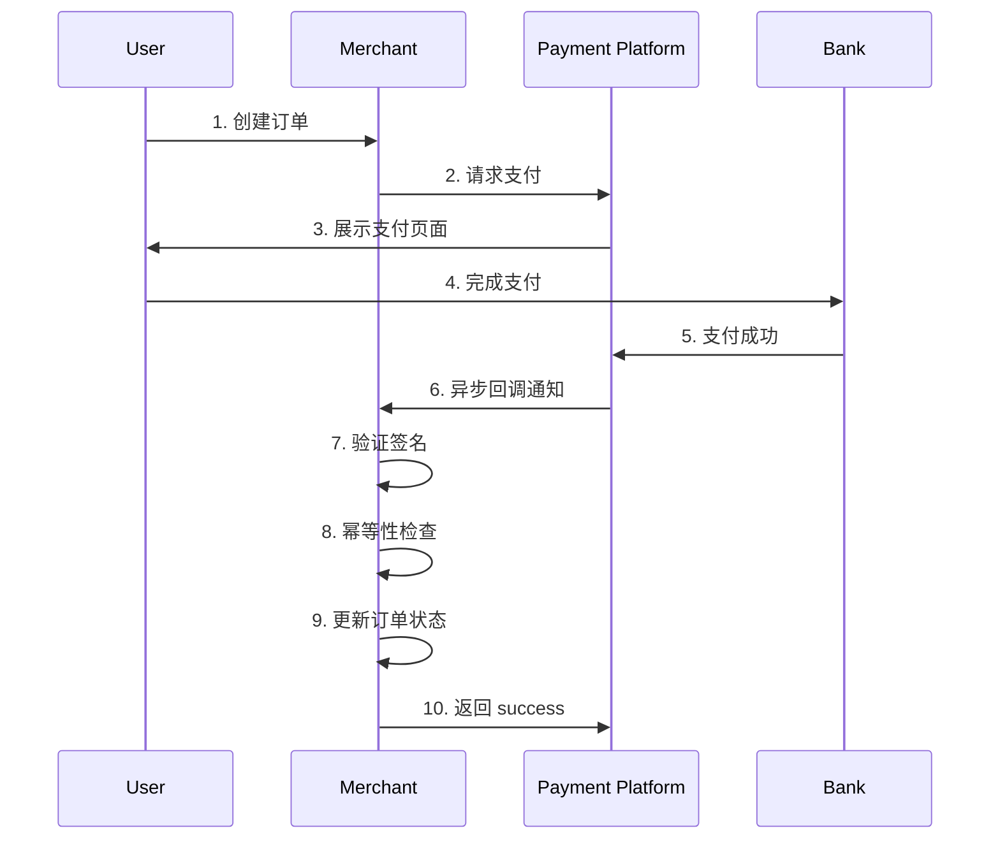

# 支付回调 - 防止重复扣款

## 目录
- [1. 概述](#1-概述)
- [2. 支付回调流程](#2-支付回调流程)
- [3. 幂等性设计](#3-幂等性设计)
- [4. C# 完整实现](#4-c-完整实现)
- [5. 异常处理](#5-异常处理)
- [6. 最佳实践](#6-最佳实践)

---

## 1. 概述

### 1.1 为什么支付回调需要幂等？

支付回调是幂等性设计的**最关键场景**之一。如果处理不当，可能导致：

**严重后果**：
- **重复充值**：用户余额被多次增加
- **重复发货**：订单被多次标记为已支付
- **数据不一致**：支付记录与订单状态不匹配
- **财务损失**：对账困难，资金流失

**回调重复的原因**：
- 网络超时，支付平台重试
- 服务端处理慢，支付平台超时重发
- 消息队列重复消费
- 人为手动触发回调

### 1.2 典型支付平台

| 平台 | 回调机制 | 重试策略 | 幂等字段 |
|------|---------|---------|---------|
| **支付宝** | HTTP POST | 最多8次，间隔递增 | out_trade_no |
| **微信支付** | HTTP POST | 最多5次，间隔递增 | transaction_id |
| **Stripe** | Webhook | 最多3天，指数退避 | id (event) |
| **PayPal** | Webhook | 最多4天 | id (event) |

---

## 2. 支付回调流程

### 2.1 标准流程



### 2.2 回调数据结构（以微信支付为例）

```json
{
  "id": "EV-20260408123456",
  "create_time": "2026-04-08T12:34:56+08:00",
  "resource_type": "encrypt-resource",
  "event_type": "TRANSACTION.SUCCESS",
  "summary": "支付成功",
  "resource": {
    "algorithm": "AEAD_AES_256_GCM",
    "ciphertext": "...加密数据...",
    "nonce": "random_nonce",
    "associated_data": "",
    "original_type": "transaction"
  }
}

// 解密后的交易数据
{
  "transaction_id": "4200001234567890",
  "out_trade_no": "ORD20260408001",
  "trade_state": "SUCCESS",
  "amount": {
    "total": 10000,
    "currency": "CNY"
  },
  "success_time": "2026-04-08T12:34:56+08:00"
}
```

---

## 3. 幂等性设计

### 3.1 核心策略

**方案1：基于支付流水号（推荐）**

```csharp
// 使用支付平台的交易号作为唯一标识
var idempotencyKey = $"payment_{transaction.TransactionId}";
```

**优点**：
- 全局唯一
- 支付平台保证不变
- 便于排查问题

**方案2：基于商户订单号**

```csharp
// 使用自己的订单号
var idempotencyKey = $"order_{order.OrderNo}";
```

**优点**：
- 可控
- 与业务关联紧密

**缺点**：
- 同一订单多次支付可能冲突

**方案3：组合键**

```csharp
// 支付平台交易号 + 商户订单号
var idempotencyKey = $"payment_{transaction.TransactionId}_{order.OrderNo}";
```

**优点**：
- 双重保险
- 适用于复杂场景

### 3.2 数据库表设计

```sql
-- 支付记录表
CREATE TABLE payment_records (
    id BIGSERIAL PRIMARY KEY,
    
    -- 业务关联
    order_id UUID NOT NULL REFERENCES orders(id),
    order_no VARCHAR(50) NOT NULL,
    
    -- 支付平台信息
    platform VARCHAR(20) NOT NULL, -- 'alipay', 'wechat', 'stripe'
    transaction_id VARCHAR(100) NOT NULL, -- 支付平台交易号
    out_trade_no VARCHAR(100), -- 商户订单号
    
    -- 支付信息
    amount DECIMAL(10, 2) NOT NULL,
    currency VARCHAR(3) NOT NULL DEFAULT 'CNY',
    status VARCHAR(20) NOT NULL, -- 'pending', 'success', 'failed', 'refunded'
    
    -- 幂等性控制
    idempotency_key VARCHAR(200) NOT NULL UNIQUE, -- 唯一索引
    
    -- 回调信息
    callback_data JSONB, -- 原始回调数据
    callback_count INTEGER NOT NULL DEFAULT 0, -- 回调次数
    first_callback_at TIMESTAMP WITH TIME ZONE,
    last_callback_at TIMESTAMP WITH TIME ZONE,
    
    -- 审计字段
    created_at TIMESTAMP WITH TIME ZONE NOT NULL DEFAULT NOW(),
    updated_at TIMESTAMP WITH TIME ZONE NOT NULL DEFAULT NOW()
);

-- 创建唯一索引
CREATE UNIQUE INDEX idx_payment_idempotency ON payment_records(idempotency_key);

-- 创建普通索引
CREATE INDEX idx_payment_transaction_id ON payment_records(transaction_id);
CREATE INDEX idx_payment_order_id ON payment_records(order_id);
CREATE INDEX idx_payment_status ON payment_records(status);

-- 注释
COMMENT ON COLUMN payment_records.idempotency_key IS '幂等键：platform_transactionId';
COMMENT ON COLUMN payment_records.callback_count IS '回调次数，用于监控异常';
```

---

## 4. C# 完整实现

### 4.1 支付回调处理器

```csharp
using Microsoft.EntityFrameworkCore;
using Idempotency.Payment.Models;

namespace Idempotency.Payment.Services
{
    public interface IPaymentCallbackHandler
    {
        Task<IResult> HandleWechatCallbackAsync(WechatPaymentCallback callback);
        Task<IResult> HandleAlipayCallbackAsync(AlipayPaymentCallback callback);
        Task<IResult> HandleStripeCallbackAsync(StripePaymentCallback callback);
    }
    
    public class PaymentCallbackHandler : IPaymentCallbackHandler
    {
        private readonly OrderDbContext _dbContext;
        private readonly ILogger<PaymentCallbackHandler> _logger;
        
        public PaymentCallbackHandler(
            OrderDbContext dbContext,
            ILogger<PaymentCallbackHandler> logger)
        {
            _dbContext = dbContext;
            _logger = logger;
        }
        
        /// <summary>
        /// 处理微信支付回调
        /// </summary>
        public async Task<IResult> HandleWechatCallbackAsync(WechatPaymentCallback callback)
        {
            try
            {
                // 1. 验证签名（略，实际必须实现）
                if (!VerifySignature(callback))
                {
                    _logger.LogWarning("Invalid signature for callback");
                    return Results.BadRequest();
                }
                
                // 2. 生成幂等键
                var idempotencyKey = $"wechat_{callback.Transaction.TransactionId}";
                
                // 3. 幂等性处理
                var existingPayment = await _dbContext.PaymentRecords
                    .Where(p => p.IdempotencyKey == idempotencyKey)
                    .FirstOrDefaultAsync();
                
                if (existingPayment != null)
                {
                    _logger.LogInformation(
                        "Duplicate callback detected. TransactionId: {TransactionId}, Count: {Count}",
                        callback.Transaction.TransactionId, 
                        existingPayment.CallbackCount);
                    
                    // 返回成功，避免支付平台重试
                    return Results.Ok(new { code = "SUCCESS", message = "OK" });
                }
                
                // 4. 开启事务
                using var transaction = await _dbContext.Database.BeginTransactionAsync();
                
                try
                {
                    // 5. 查询订单
                    var order = await _dbContext.Orders
                        .Where(o => o.OrderNo == callback.Transaction.OutTradeNo)
                        .FirstOrDefaultAsync();
                    
                    if (order == null)
                    {
                        _logger.LogError("Order not found: {OrderNo}", 
                            callback.Transaction.OutTradeNo);
                        return Results.BadRequest();
                    }
                    
                    // 6. 验证金额
                    if (order.TotalAmount != callback.Transaction.Amount.Total / 100.0m)
                    {
                        _logger.LogError(
                            "Amount mismatch. Order: {OrderAmount}, Callback: {CallbackAmount}",
                            order.TotalAmount,
                            callback.Transaction.Amount.Total / 100.0m);
                        
                        return Results.BadRequest();
                    }
                    
                    // 7. 创建支付记录
                    var paymentRecord = new PaymentRecord
                    {
                        OrderId = order.Id,
                        OrderNo = order.OrderNo,
                        Platform = "wechat",
                        TransactionId = callback.Transaction.TransactionId,
                        OutTradeNo = callback.Transaction.OutTradeNo,
                        Amount = callback.Transaction.Amount.Total / 100.0m,
                        Currency = "CNY",
                        Status = "success",
                        IdempotencyKey = idempotencyKey,
                        CallbackData = SerializeToJson(callback),
                        CallbackCount = 1,
                        FirstCallbackAt = DateTime.UtcNow,
                        LastCallbackAt = DateTime.UtcNow,
                        CreatedAt = DateTime.UtcNow
                    };
                    
                    _dbContext.PaymentRecords.Add(paymentRecord);
                    
                    // 8. 更新订单状态
                    order.Status = OrderStatus.Paid;
                    order.PaidAt = DateTime.UtcNow;
                    order.PaymentTransactionId = callback.Transaction.TransactionId;
                    
                    await _dbContext.SaveChangesAsync();
                    await transaction.CommitAsync();
                    
                    _logger.LogInformation(
                        "Payment processed successfully. Order: {OrderNo}, TransactionId: {TransactionId}",
                        order.OrderNo, callback.Transaction.TransactionId);
                    
                    return Results.Ok(new { code = "SUCCESS", message = "OK" });
                }
                catch
                {
                    await transaction.RollbackAsync();
                    throw;
                }
            }
            catch (Exception ex)
            {
                _logger.LogError(ex, "Error processing WeChat payment callback");
                return Results.Problem("Internal server error");
            }
        }
        
        /// <summary>
        /// 处理支付宝回调
        /// </summary>
        public async Task<IResult> HandleAlipayCallbackAsync(AlipayPaymentCallback callback)
        {
            // 类似微信的实现，略
            throw new NotImplementedException();
        }
        
        /// <summary>
        /// 处理 Stripe 回调
        /// </summary>
        public async Task<IResult> HandleStripeCallbackAsync(StripePaymentCallback callback)
        {
            // 类似微信的实现，略
            throw new NotImplementedException();
        }
        
        private bool VerifySignature<T>(T callback)
        {
            // 实现签名验证逻辑
            return true;
        }
        
        private string SerializeToJson(object obj)
        {
            return JsonSerializer.Serialize(obj);
        }
    }
}
```

### 4.2 Minimal API 端点

```csharp
// Program.cs
var app = builder.Build();

// 微信支付回调
app.MapPost("/api/webhooks/wechat", async (
    WechatPaymentCallback callback,
    IPaymentCallbackHandler handler) =>
{
    return await handler.HandleWechatCallbackAsync(callback);
})
.WithName("WechatPaymentWebhook")
.DisableAntiforgery(); // Webhook 不需要 CSRF 保护

// 支付宝回调
app.MapPost("/api/webhooks/alipay", async (
    AlipayPaymentCallback callback,
    IPaymentCallbackHandler handler) =>
{
    return await handler.HandleAlipayCallbackAsync(callback);
})
.WithName("AlipayPaymentWebhook")
.DisableAntiforgery();

// Stripe 回调
app.MapPost("/api/webhooks/stripe", async (
    StripePaymentCallback callback,
    IPaymentCallbackHandler handler) =>
{
    return await handler.HandleStripeCallbackAsync(callback);
})
.WithName("StripePaymentWebhook")
.DisableAntiforgery();

app.Run();
```

### 4.3 使用 Redis 增强幂等性

```csharp
public class RedisBackedPaymentHandler : IPaymentCallbackHandler
{
    private readonly IDatabase _redis;
    private readonly OrderDbContext _dbContext;
    
    public async Task<IResult> HandleWechatCallbackAsync(WechatPaymentCallback callback)
    {
        var idempotencyKey = $"payment:wechat:{callback.Transaction.TransactionId}";
        
        // 尝试获取分布式锁
        var lockAcquired = await _redis.StringSetAsync(
            $"{idempotencyKey}:lock",
            "processing",
            TimeSpan.FromMinutes(5),
            When.NotExists);
        
        if (!lockAcquired)
        {
            _logger.LogWarning("Callback is being processed by another instance");
            return Results.Ok(new { code = "SUCCESS", message = "Processing" });
        }
        
        try
        {
            // 检查是否已处理
            var alreadyProcessed = await _redis.KeyExistsAsync(idempotencyKey);
            if (alreadyProcessed)
            {
                return Results.Ok(new { code = "SUCCESS", message = "Already processed" });
            }
            
            // 处理支付...
            await ProcessPaymentAsync(callback);
            
            // 标记为已处理（24小时过期）
            await _redis.StringSetAsync(
                idempotencyKey, 
                "completed", 
                TimeSpan.FromHours(24));
            
            return Results.Ok(new { code = "SUCCESS", message = "OK" });
        }
        finally
        {
            // 释放锁
            await _redis.KeyDeleteAsync($"{idempotencyKey}:lock");
        }
    }
}
```

---

## 5. 异常处理

### 5.1 常见异常场景

| 场景 | 处理方式 |
|------|---------|
| **订单不存在** | 记录日志，返回失败 |
| **金额不匹配** | 拒绝处理，告警 |
| **订单已支付** | 返回成功（幂等） |
| **数据库异常** | 回滚事务，返回失败触发重试 |
| **签名验证失败** | 拒绝处理，记录安全日志 |

### 5.2 异常处理示例

```csharp
public class RobustPaymentHandler
{
    public async Task<IResult> HandleCallbackAsync(PaymentCallback callback)
    {
        try
        {
            return await ProcessCallbackInternalAsync(callback);
        }
        catch (OrderNotFoundException ex)
        {
            _logger.LogError(ex, "Order not found: {OrderNo}", ex.OrderNo);
            return Results.BadRequest(new { error = "Order not found" });
        }
        catch (AmountMismatchException ex)
        {
            _logger.LogCritical(ex, 
                "Amount mismatch! Order: {OrderAmount}, Received: {ReceivedAmount}",
                ex.ExpectedAmount, ex.ReceivedAmount);
            
            // 发送告警
            await SendAlertAsync(ex);
            
            return Results.BadRequest(new { error = "Amount mismatch" });
        }
        catch (DbUpdateException ex)
        {
            _logger.LogError(ex, "Database error processing callback");
            
            // 返回失败，让支付平台重试
            return Results.Problem("Database error, will retry");
        }
        catch (Exception ex)
        {
            _logger.LogCritical(ex, "Unhandled exception in callback handler");
            return Results.Problem("Internal server error");
        }
    }
}
```

---

## 6. 最佳实践

### 6.1 必须做的事情

✅ **验证签名**
```csharp
// 始终验证回调签名，防止伪造
if (!VerifySignature(callback, platformPublicKey))
{
    return Results.Unauthorized();
}
```

✅ **验证金额**
```csharp
// 验证回调金额与订单金额一致
if (order.TotalAmount != callback.Amount)
{
    _logger.LogCritical("Amount mismatch!");
    return Results.BadRequest();
}
```

✅ **记录原始数据**
```csharp
// 保存完整的回调数据用于排查
paymentRecord.CallbackData = JsonSerializer.Serialize(callback);
```

✅ **监控回调次数**
```csharp
// 如果回调次数过多，说明有异常
if (paymentRecord.CallbackCount > 5)
{
    _logger.LogWarning("Excessive callbacks for transaction {TransactionId}", 
        transactionId);
}
```

✅ **快速返回成功**
```csharp
// 先返回成功，再异步处理复杂逻辑
return Results.Ok(new { code = "SUCCESS" });
```

### 6.2 禁止做的事情

❌ **不要信任回调数据**
```csharp
// ❌ 错误：直接使用回调数据
var amount = callback.Amount;

// ✅ 正确：从数据库查询订单金额
var order = await _dbContext.Orders.FindAsync(callback.OrderId);
```

❌ **不要长时间阻塞**
```csharp
// ❌ 错误：同步发送邮件
await _emailService.SendConfirmationEmail(order.UserId);

// ✅ 正确：异步发送
_backgroundTaskQueue.QueueBackgroundWorkItem(
    async ct => await _emailService.SendConfirmationEmail(order.UserId));
```

❌ **不要忽略日志**
```csharp
// ❌ 错误：静默失败
catch (Exception ex) { }

// ✅ 正确：详细记录
catch (Exception ex)
{
    _logger.LogError(ex, "Error processing callback");
    throw;
}
```

### 6.3 监控指标

```csharp
public class PaymentCallbackMetrics
{
    private readonly Counter<long> _callbacksTotal;
    private readonly Counter<long> _duplicatesDetected;
    private readonly Histogram<double> _processingTime;
    private readonly Counter<long> _failures;
    
    public void RecordCallback(bool isDuplicate, double processingTimeMs, bool success)
    {
        _callbacksTotal.Add(1);
        
        if (isDuplicate)
            _duplicatesDetected.Add(1);
        
        _processingTime.Record(processingTimeMs);
        
        if (!success)
            _failures.Add(1);
    }
}
```

---

## 总结

支付回调的幂等性设计关乎资金安全，必须严谨对待：

### 核心要点

1. **唯一标识**：使用支付平台交易号作为幂等键
2. **数据库约束**：唯一索引保证不会重复插入
3. **快速返回**：先返回成功，再异步处理
4. **完整日志**：记录所有回调用于对账

### 最佳实践

- ✅ 验证签名和金额
- ✅ 使用事务保证原子性
- ✅ 记录原始回调数据
- ✅ 监控异常回调次数
- ✅ 快速响应支付平台

通过完善的幂等性设计，可以确保支付系统的安全性和可靠性。
