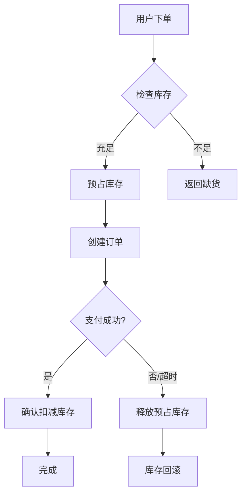

# 库存扣减幂等 - 高并发场景下的库存管理

## 目录
- [1. 概述](#1-概述)
- [2. 核心挑战](#2-核心挑战)
- [3. 数据库层面的幂等实现](#3-数据库层面的幂等实现)
- [4. Redis 原子操作实现](#4-redis-原子操作实现)
- [5. C# 完整实现](#5-c-完整实现)
- [6. 秒杀场景优化](#6-秒杀场景优化)
- [7. 异常处理与补偿](#7-异常处理与补偿)
- [8. 最佳实践](#8-最佳实践)

---

## 1. 概述

### 1.1 为什么库存扣减需要幂等？

库存扣减是电商系统中最核心的业务之一，也是幂等性设计的典型场景：

**问题场景**：
- 用户下单时网络超时，客户端重试导致重复扣减库存
- 支付回调延迟，多次触发库存确认
- 分布式系统中多个服务实例同时处理同一订单
- 消息队列重复消费导致库存被多次扣减

**后果**：
- **超卖**：库存变为负数，无法发货
- **数据不一致**：订单数量与实际库存不匹配
- **用户体验差**：下单成功但无法发货，需要退款

### 1.2 库存扣减的核心流程



### 1.3 三种库存扣减模式

| 模式 | 时机 | 优点 | 缺点 | 适用场景 |
|------|------|------|------|---------|
| **下单扣减** | 创建订单时立即扣减 | 简单直接，不会超卖 | 未支付订单占用库存 | 普通商品 |
| **支付扣减** | 支付成功后扣减 | 库存利用率高 | 可能超卖（需预留缓冲） | 紧俏商品 |
| **预占+确认** | 下单预占，支付确认 | 平衡体验与准确性 | 实现复杂 | 秒杀/预售 |

---

## 2. 核心挑战

### 2.1 并发冲突场景

#### 场景1：同一用户重复提交

```
时间线：
T1: 用户点击"立即购买" → 请求A到达服务器
T2: 用户再次点击（网络延迟） → 请求B到达服务器
T3: 请求A检查库存：剩余10件
T4: 请求B检查库存：剩余10件（请求A尚未扣减）
T5: 请求A扣减1件 → 剩余9件
T6: 请求B扣减1件 → 剩余8件

结果：用户下了2单，但只想要1件
```

#### 场景2：多用户同时购买最后一件商品

```
时间线：
T1: 用户A查询库存：剩余1件
T2: 用户B查询库存：剩余1件
T3: 用户A扣减1件 → 剩余0件
T4: 用户B扣减1件 → 剩余-1件 ❌ 超卖！

结果：超卖，无法满足两个订单
```

#### 场景3：支付回调重复

```
时间线：
T1: 用户完成支付
T2: 支付平台第1次回调通知
T3: 服务器处理中（耗时较长）
T4: 支付平台超时，第2次回调通知
T5: 服务器再次处理

结果：如果没有幂等性保证，库存被扣减2次
```

### 2.2 分布式系统挑战

```
┌─────────────┐         ┌──────────────┐         ┌─────────────┐
│  订单服务    │────────▶│  库存服务     │◀────────│  支付服务    │
│             │         │              │         │             │
│ 创建订单     │         │ 扣减库存      │         │ 支付回调     │
└─────────────┘         └──────────────┘         └─────────────┘
                              │
                        ┌─────▼─────┐
                        │  Redis    │
                        │  (缓存)   │
                        └───────────┘

问题：
1. 订单服务和库存服务可能不在同一台服务器
2. 网络延迟可能导致请求乱序
3. 缓存和数据库可能不一致
```

---

## 3. 数据库层面的幂等实现

### 3.1 库存表设计（PostgreSQL）

```sql
-- 创建商品库存表
CREATE TABLE product_inventory (
    id UUID PRIMARY KEY DEFAULT gen_random_uuid(),
    product_id UUID NOT NULL UNIQUE, -- 商品ID
    product_name VARCHAR(200) NOT NULL,
    
    -- 库存信息
    total_stock INTEGER NOT NULL DEFAULT 0,      -- 总库存
    available_stock INTEGER NOT NULL DEFAULT 0,  -- 可用库存
    reserved_stock INTEGER NOT NULL DEFAULT 0,   -- 预占库存
    
    -- 版本控制（乐观锁）
    version INTEGER NOT NULL DEFAULT 1,
    
    -- 审计字段
    created_at TIMESTAMP WITH TIME ZONE NOT NULL DEFAULT NOW(),
    updated_at TIMESTAMP WITH TIME ZONE NOT NULL DEFAULT NOW(),
    
    -- 约束
    CONSTRAINT chk_stock_non_negative CHECK (
        available_stock >= 0 
        AND reserved_stock >= 0 
        AND total_stock = available_stock + reserved_stock
    )
);

-- 创建索引
CREATE INDEX idx_product_inventory_product_id ON product_inventory(product_id);

-- 注释
COMMENT ON COLUMN product_inventory.total_stock IS '总库存 = 可用库存 + 预占库存';
COMMENT ON COLUMN product_inventory.available_stock IS '可用库存：可以被购买的库存';
COMMENT ON COLUMN product_inventory.reserved_stock IS '预占库存：已下单但未支付的库存';
COMMENT ON COLUMN product_inventory.version IS '乐观锁版本号';
```

### 3.2 库存流水表（用于幂等校验）

```sql
-- 创建库存流水表
CREATE TABLE inventory_transaction (
    id BIGSERIAL PRIMARY KEY,
    product_id UUID NOT NULL REFERENCES product_inventory(product_id),
    
    -- 业务关联
    order_id UUID NOT NULL, -- 订单ID
    user_id UUID NOT NULL,  -- 用户ID
    
    -- 交易信息
    transaction_type SMALLINT NOT NULL, -- 1=预占, 2=确认扣减, 3=释放预占, 4=补货
    quantity INTEGER NOT NULL, -- 数量（正数表示增加，负数表示减少）
    
    -- 幂等性控制
    idempotency_key VARCHAR(100) NOT NULL UNIQUE, -- 幂等键：order_id + type
    business_type VARCHAR(50) NOT NULL, -- 业务类型：ORDER_CREATE, ORDER_PAY, ORDER_CANCEL
    
    -- 状态
    status SMALLINT NOT NULL DEFAULT 1, -- 1=处理中, 2=已完成, 3=已取消
    
    -- 快照信息
    stock_before INTEGER NOT NULL, -- 操作前的库存
    stock_after INTEGER NOT NULL,  -- 操作后的库存
    
    -- 审计字段
    created_at TIMESTAMP WITH TIME ZONE NOT NULL DEFAULT NOW(),
    processed_at TIMESTAMP WITH TIME ZONE,
    error_message TEXT
);

-- 创建唯一索引（幂等性保证）
CREATE UNIQUE INDEX idx_inventory_txn_idempotency ON inventory_transaction(idempotency_key);

-- 创建复合索引
CREATE INDEX idx_inventory_txn_order_id ON inventory_transaction(order_id);
CREATE INDEX idx_inventory_txn_product_id ON inventory_transaction(product_id);
CREATE INDEX idx_inventory_txn_created_at ON inventory_transaction(created_at DESC);

-- 注释
COMMENT ON COLUMN inventory_transaction.transaction_type IS '交易类型: 1=预占, 2=确认扣减, 3=释放预占, 4=补货';
COMMENT ON COLUMN inventory_transaction.idempotency_key IS '幂等键，防止重复处理';
COMMENT ON COLUMN inventory_transaction.stock_before IS '操作前的库存快照';
COMMENT ON COLUMN inventory_transaction.stock_after IS '操作后的库存快照';
```

### 3.3 使用存储过程保证原子性

```sql
-- 创建库存预占函数
CREATE OR REPLACE FUNCTION reserve_inventory(
    p_product_id UUID,
    p_quantity INTEGER,
    p_order_id UUID,
    p_user_id UUID,
    p_idempotency_key VARCHAR(100)
)
RETURNS TABLE(success BOOLEAN, message TEXT, available_stock INTEGER) AS $$
DECLARE
    v_current_available INTEGER;
    v_current_reserved INTEGER;
    v_version INTEGER;
    v_new_available INTEGER;
    v_new_reserved INTEGER;
BEGIN
    -- 检查是否已处理（幂等性）
    IF EXISTS (SELECT 1 FROM inventory_transaction WHERE idempotency_key = p_idempotency_key) THEN
        SELECT it.stock_after INTO v_current_available
        FROM inventory_transaction it
        WHERE it.idempotency_key = p_idempotency_key;
        
        RETURN QUERY SELECT TRUE, 'Already processed'::TEXT, v_current_available;
        RETURN;
    END IF;

    -- 开启事务
    BEGIN
        -- 锁定库存记录（悲观锁）
        SELECT available_stock, reserved_stock, version
        INTO v_current_available, v_current_reserved, v_version
        FROM product_inventory
        WHERE product_id = p_product_id
        FOR UPDATE;
        
        -- 检查库存是否充足
        IF v_current_available < p_quantity THEN
            RETURN QUERY SELECT FALSE, 'Insufficient stock'::TEXT, v_current_available;
            RETURN;
        END IF;
        
        -- 计算新值
        v_new_available := v_current_available - p_quantity;
        v_new_reserved := v_current_reserved + p_quantity;
        
        -- 更新库存（乐观锁）
        UPDATE product_inventory
        SET 
            available_stock = v_new_available,
            reserved_stock = v_new_reserved,
            version = version + 1,
            updated_at = NOW()
        WHERE product_id = p_product_id AND version = v_version;
        
        -- 记录流水
        INSERT INTO inventory_transaction (
            product_id, order_id, user_id, transaction_type,
            quantity, idempotency_key, business_type,
            status, stock_before, stock_after, created_at
        ) VALUES (
            p_product_id, p_order_id, p_user_id, 1, -- type=1 预占
            -p_quantity, p_idempotency_key, 'ORDER_CREATE',
            2, -- status=2 已完成
            v_current_available, v_new_available, NOW()
        );
        
        RETURN QUERY SELECT TRUE, 'Success'::TEXT, v_new_available;
        
    EXCEPTION
        WHEN OTHERS THEN
            RETURN QUERY SELECT FALSE, SQLERRM, v_current_available;
    END;
END;
$$ LANGUAGE plpgsql;

-- 使用示例
SELECT * FROM reserve_inventory(
    'product-uuid-here',
    2, -- 数量
    'order-uuid-here',
    'user-uuid-here',
    'reserve_order-uuid-here' -- 幂等键
);
```

### 3.4 确认扣减和释放预占

```sql
-- 创建确认扣减函数（支付成功后调用）
CREATE OR REPLACE FUNCTION confirm_inventory_deduction(
    p_order_id UUID,
    p_idempotency_key VARCHAR(100)
)
RETURNS TABLE(success BOOLEAN, message TEXT) AS $$
DECLARE
    v_order_record RECORD;
    v_current_reserved INTEGER;
BEGIN
    -- 检查是否已处理
    IF EXISTS (SELECT 1 FROM inventory_transaction WHERE idempotency_key = p_idempotency_key) THEN
        RETURN QUERY SELECT TRUE, 'Already processed'::TEXT;
        RETURN;
    END IF;
    
    BEGIN
        -- 获取订单信息
        SELECT product_id, quantity
        INTO v_order_record
        FROM orders
        WHERE id = p_order_id;
        
        -- 更新库存：预占转扣减
        UPDATE product_inventory
        SET 
            reserved_stock = reserved_stock - v_order_record.quantity,
            total_stock = total_stock - v_order_record.quantity,
            version = version + 1,
            updated_at = NOW()
        WHERE product_id = v_order_record.product_id;
        
        -- 记录流水
        INSERT INTO inventory_transaction (
            product_id, order_id, user_id, transaction_type,
            quantity, idempotency_key, business_type,
            status, stock_before, stock_after, created_at
        ) VALUES (
            v_order_record.product_id, p_order_id, 
            v_order_record.user_id, 2, -- type=2 确认扣减
            -v_order_record.quantity, p_idempotency_key, 'ORDER_PAY',
            2, NOW(), NOW() - v_order_record.quantity, NOW()
        );
        
        RETURN QUERY SELECT TRUE, 'Success'::TEXT;
        
    EXCEPTION
        WHEN OTHERS THEN
            RETURN QUERY SELECT FALSE, SQLERRM;
    END;
END;
$$ LANGUAGE plpgsql;

-- 创建释放预占函数（订单取消或超时未支付）
CREATE OR REPLACE FUNCTION release_reserved_inventory(
    p_order_id UUID,
    p_idempotency_key VARCHAR(100)
)
RETURNS TABLE(success BOOLEAN, message TEXT, available_stock INTEGER) AS $$
DECLARE
    v_order_record RECORD;
    v_current_available INTEGER;
    v_new_available INTEGER;
BEGIN
    -- 检查是否已处理
    IF EXISTS (SELECT 1 FROM inventory_transaction WHERE idempotency_key = p_idempotency_key) THEN
        SELECT it.stock_after INTO v_current_available
        FROM inventory_transaction it
        WHERE it.idempotency_key = p_idempotency_key;
        
        RETURN QUERY SELECT TRUE, 'Already processed'::TEXT, v_current_available;
        RETURN;
    END IF;
    
    BEGIN
        -- 获取订单信息
        SELECT product_id, quantity
        INTO v_order_record
        FROM orders
        WHERE id = p_order_id;
        
        -- 释放预占：预占库存转回可用库存
        UPDATE product_inventory
        SET 
            available_stock = available_stock + v_order_record.quantity,
            reserved_stock = reserved_stock - v_order_record.quantity,
            version = version + 1,
            updated_at = NOW()
        WHERE product_id = v_order_record.product_id
        RETURNING available_stock INTO v_new_available;
        
        -- 记录流水
        INSERT INTO inventory_transaction (
            product_id, order_id, user_id, transaction_type,
            quantity, idempotency_key, business_type,
            status, stock_before, stock_after, created_at
        ) VALUES (
            v_order_record.product_id, p_order_id,
            v_order_record.user_id, 3, -- type=3 释放预占
            v_order_record.quantity, p_idempotency_key, 'ORDER_CANCEL',
            2, v_new_available - v_order_record.quantity, v_new_available, NOW()
        );
        
        RETURN QUERY SELECT TRUE, 'Success'::TEXT, v_new_available;
        
    EXCEPTION
        WHEN OTHERS THEN
            RETURN QUERY SELECT FALSE, SQLERRM, 0;
    END;
END;
$$ LANGUAGE plpgsql;
```

---

## 4. Redis 原子操作实现

### 4.1 使用 Lua 脚本保证原子性

```lua
-- redis_reserve_stock.lua
-- KEYS[1]: 商品库存key (stock:{product_id})
-- KEYS[2]: 预占记录key (reserved:{order_id})
-- ARGV[1]: 购买数量
-- ARGV[2]: 订单ID
-- ARGV[3]: 用户ID
-- ARGV[4]: 过期时间（秒）

local stock_key = KEYS[1]
local reserved_key = KEYS[2]
local quantity = tonumber(ARGV[1])
local order_id = ARGV[2]
local user_id = ARGV[3]
local ttl = tonumber(ARGV[4])

-- 检查是否已预占（幂等性）
local existing_reservation = redis.call('GET', reserved_key)
if existing_reservation then
    return {1, tonumber(existing_reservation)} -- 已预占，返回当前库存
end

-- 检查库存
local current_stock = tonumber(redis.call('GET', stock_key) or '0')
if current_stock < quantity then
    return {-1, current_stock} -- 库存不足
end

-- 扣减库存
local new_stock = current_stock - quantity
redis.call('SET', stock_key, new_stock)
redis.call('EXPIRE', stock_key, ttl)

-- 记录预占
redis.call('SET', reserved_key, new_stock, 'EX', ttl)

-- 记录预占详情（用于后续确认或释放）
local reservation_detail = string.format('%s:%s:%s', order_id, user_id, quantity)
redis.call('HSET', 'reservation_details', reserved_key, reservation_detail)

return {0, new_stock} -- 成功，返回剩余库存
```

### 4.2 C# 调用 Lua 脚本

```csharp
using StackExchange.Redis;
using System.Threading.Tasks;

namespace Idempotency.Inventory.Services
{
    public interface IInventoryCacheService
    {
        Task<(bool Success, int RemainingStock)> ReserveStockAsync(
            Guid productId, int quantity, Guid orderId, Guid userId, TimeSpan expiry);
        
        Task<bool> ConfirmReservationAsync(Guid orderId);
        Task<bool> ReleaseReservationAsync(Guid orderId);
    }
    
    public class InventoryCacheService : IInventoryCacheService
    {
        private readonly IConnectionMultiplexer _redis;
        private readonly IDatabase _db;
        private readonly ILogger<InventoryCacheService> _logger;
        
        // Lua 脚本
        private static readonly string _reserveScript = @"
            local stock_key = KEYS[1]
            local reserved_key = KEYS[2]
            local quantity = tonumber(ARGV[1])
            local order_id = ARGV[2]
            local user_id = ARGV[3]
            local ttl = tonumber(ARGV[4])
            
            -- 检查是否已预占（幂等性）
            local existing_reservation = redis.call('GET', reserved_key)
            if existing_reservation then
                return {1, tonumber(existing_reservation)}
            end
            
            -- 检查库存
            local current_stock = tonumber(redis.call('GET', stock_key) or '0')
            if current_stock < quantity then
                return {-1, current_stock}
            end
            
            -- 扣减库存
            local new_stock = current_stock - quantity
            redis.call('SET', stock_key, new_stock)
            redis.call('EXPIRE', stock_key, ttl)
            
            -- 记录预占
            redis.call('SET', reserved_key, new_stock, 'EX', ttl)
            
            return {0, new_stock}
        ";
        
        private static readonly string _confirmScript = @"
            local reserved_key = KEYS[1]
            local details_key = KEYS[2]
            
            -- 检查预占是否存在
            local reservation = redis.call('GET', reserved_key)
            if not reservation then
                return 0 -- 预占不存在或已过期
            end
            
            -- 删除预占记录
            redis.call('DEL', reserved_key)
            redis.call('HDEL', details_key, reserved_key)
            
            return 1 -- 确认成功
        ";
        
        private static readonly string _releaseScript = @"
            local stock_key = KEYS[1]
            local reserved_key = KEYS[2]
            local details_key = KEYS[3]
            
            -- 获取预占数量
            local reservation = redis.call('GET', reserved_key)
            if not reservation then
                return {0, tonumber(redis.call('GET', stock_key) or '0')}
            end
            
            -- 从详情中获取数量
            local detail = redis.call('HGET', details_key, reserved_key)
            local quantity = 0
            if detail then
                local parts = {}
                for part in string.gmatch(detail, '([^:]+)') do
                    table.insert(parts, part)
                end
                quantity = tonumber(parts[3])
            end
            
            -- 恢复库存
            local current_stock = tonumber(redis.call('GET', stock_key) or '0')
            local new_stock = current_stock + quantity
            redis.call('SET', stock_key, new_stock)
            
            -- 删除预占记录
            redis.call('DEL', reserved_key)
            redis.call('HDEL', details_key, reserved_key)
            
            return {1, new_stock}
        ";
        
        private readonly LoadedLuaScript _loadedReserveScript;
        private readonly LoadedLuaScript _loadedConfirmScript;
        private readonly LoadedLuaScript _loadedReleaseScript;
        
        public InventoryCacheService(
            IConnectionMultiplexer redis,
            ILogger<InventoryCacheService> logger)
        {
            _redis = redis;
            _db = redis.GetDatabase();
            _logger = logger;
            
            // 预加载 Lua 脚本到 Redis
            _loadedReserveScript = LoadScript(_reserveScript);
            _loadedConfirmScript = LoadScript(_confirmScript);
            _loadedReleaseScript = LoadScript(_releaseScript);
        }
        
        private LoadedLuaScript LoadScript(string script)
        {
            var prepared = LuaScript.Prepare(script);
            return prepared.Load(_redis.GetEndPoints().First());
        }
        
        public async Task<(bool Success, int RemainingStock)> ReserveStockAsync(
            Guid productId, int quantity, Guid orderId, Guid userId, TimeSpan expiry)
        {
            try
            {
                var stockKey = $"stock:{productId}";
                var reservedKey = $"reserved:{orderId}";
                
                var result = await _db.ScriptEvaluateAsync(
                    _loadedReserveScript,
                    new RedisKey[] { stockKey, reservedKey },
                    new RedisValue[] { quantity, orderId.ToString(), userId.ToString(), (int)expiry.TotalSeconds });
                
                var values = (RedisResult[])result;
                var status = (int)values[0];
                var remainingStock = (int)values[1];
                
                switch (status)
                {
                    case 0: // 成功
                        _logger.LogInformation(
                            "Stock reserved successfully. Product: {ProductId}, Quantity: {Quantity}, Remaining: {Remaining}",
                            productId, quantity, remainingStock);
                        return (true, remainingStock);
                        
                    case 1: // 已预占（幂等）
                        _logger.LogWarning(
                            "Duplicate reservation for order {OrderId}. Returning cached result.",
                            orderId);
                        return (true, remainingStock);
                        
                    case -1: // 库存不足
                        _logger.LogWarning(
                            "Insufficient stock for product {ProductId}. Requested: {Quantity}, Available: {Available}",
                            productId, quantity, remainingStock);
                        return (false, remainingStock);
                        
                    default:
                        return (false, remainingStock);
                }
            }
            catch (Exception ex)
            {
                _logger.LogError(ex, "Error reserving stock for product {ProductId}", productId);
                throw;
            }
        }
        
        public async Task<bool> ConfirmReservationAsync(Guid orderId)
        {
            try
            {
                var reservedKey = $"reserved:{orderId}";
                var detailsKey = "reservation_details";
                
                var result = await _db.ScriptEvaluateAsync(
                    _loadedConfirmScript,
                    new RedisKey[] { reservedKey, detailsKey },
                    RedisValue.EmptyArray);
                
                return (int)result == 1;
            }
            catch (Exception ex)
            {
                _logger.LogError(ex, "Error confirming reservation for order {OrderId}", orderId);
                throw;
            }
        }
        
        public async Task<bool> ReleaseReservationAsync(Guid orderId)
        {
            try
            {
                // 需要从数据库查询产品ID来构建stock key
                // 这里简化处理，实际应该在预订详情中存储
                var reservedKey = $"reserved:{orderId}";
                var detailsKey = "reservation_details";
                var stockKey = "stock:unknown"; // 实际应该动态获取
                
                var result = await _db.ScriptEvaluateAsync(
                    _loadedReleaseScript,
                    new RedisKey[] { stockKey, reservedKey, detailsKey },
                    RedisValue.EmptyArray);
                
                var values = (RedisResult[])result;
                var success = (int)values[0] == 1;
                var newStock = (int)values[1];
                
                return success;
            }
            catch (Exception ex)
            {
                _logger.LogError(ex, "Error releasing reservation for order {OrderId}", orderId);
                throw;
            }
        }
    }
}
```

### 4.3 同步缓存与数据库

```csharp
public class InventorySyncService
{
    private readonly IInventoryCacheService _cacheService;
    private readonly OrderDbContext _dbContext;
    private readonly ILogger<InventorySyncService> _logger;
    
    public InventorySyncService(
        IInventoryCacheService cacheService,
        OrderDbContext dbContext,
        ILogger<InventorySyncService> logger)
    {
        _cacheService = cacheService;
        _dbContext = dbContext;
        _logger = logger;
    }
    
    /// <summary>
    /// 异步同步库存（最终一致性）
    /// </summary>
    public async Task SyncInventoryAsync(Guid productId)
    {
        var cacheKey = $"stock:{productId}";
        
        try
        {
            // 1. 从数据库查询真实库存
            var dbInventory = await _dbContext.ProductInventories
                .Where(p => p.ProductId == productId)
                .FirstOrDefaultAsync();
            
            if (dbInventory == null) return;
            
            // 2. 更新 Redis 库存
            var db = _cacheService.GetDatabase();
            await db.StringSetAsync(cacheKey, dbInventory.AvailableStock);
            
            _logger.LogInformation(
                "Inventory synced for product {ProductId}. DB: {DbStock}, Cache updated",
                productId, dbInventory.AvailableStock);
        }
        catch (Exception ex)
        {
            _logger.LogError(ex, "Error syncing inventory for product {ProductId}", productId);
            throw;
        }
    }
    
    /// <summary>
    /// 定期对账任务
    /// </summary>
    public async Task ReconcileInventoryAsync()
    {
        var products = await _dbContext.ProductInventories.ToListAsync();
        
        foreach (var product in products)
        {
            try
            {
                var cacheKey = $"stock:{product.ProductId}";
                var db = _cacheService.GetDatabase();
                var cachedStock = await db.StringGetAsync(cacheKey);
                
                if (cachedStock.HasValue && (int)cachedStock != product.AvailableStock)
                {
                    _logger.LogWarning(
                        "Inventory mismatch for product {ProductId}. DB: {DbStock}, Cache: {CacheStock}",
                        product.ProductId, product.AvailableStock, (int)cachedStock);
                    
                    // 修复缓存
                    await db.StringSetAsync(cacheKey, product.AvailableStock);
                }
            }
            catch (Exception ex)
            {
                _logger.LogError(ex, "Error reconciling inventory for product {ProductId}", product.ProductId);
            }
        }
    }
}
```

---

## 5. C# 完整实现

### 5.1 库存服务接口

```csharp
namespace Idempotency.Inventory.Core
{
    public interface IInventoryService
    {
        /// <summary>
        /// 预占库存（下单时调用）
        /// </summary>
        Task<Result<string>> ReserveStockAsync(ReserveStockRequest request);
        
        /// <summary>
        /// 确认扣减（支付成功后调用）
        /// </summary>
        Task<Result> ConfirmDeductionAsync(Guid orderId);
        
        /// <summary>
        /// 释放预占（订单取消或超时未支付）
        /// </summary>
        Task<Result> ReleaseReservationAsync(Guid orderId);
        
        /// <summary>
        /// 查询库存
        /// </summary>
        Task<Result<InventoryDto>> GetInventoryAsync(Guid productId);
    }
    
    public record ReserveStockRequest(
        Guid ProductId,
        int Quantity,
        Guid OrderId,
        Guid UserId
    );
    
    public record InventoryDto(
        Guid ProductId,
        int TotalStock,
        int AvailableStock,
        int ReservedStock
    );
}
```

### 5.2 库存服务实现

```csharp
using Microsoft.EntityFrameworkCore;
using Idempotency.Inventory.Core;
using Idempotency.Inventory.Models;

namespace Idempotency.Inventory.Services
{
    public class InventoryService : IInventoryService
    {
        private readonly OrderDbContext _dbContext;
        private readonly IInventoryCacheService _cacheService;
        private readonly ILogger<InventoryService> _logger;
        
        public InventoryService(
            OrderDbContext dbContext,
            IInventoryCacheService cacheService,
            ILogger<InventoryService> logger)
        {
            _dbContext = dbContext;
            _cacheService = cacheService;
            _logger = logger;
        }
        
        /// <summary>
        /// 预占库存（带幂等性保证）
        /// </summary>
        public async Task<Result<string>> ReserveStockAsync(ReserveStockRequest request)
        {
            using var activity = ActivitySource.StartActivity("ReserveStock");
            activity?.SetTag("product_id", request.ProductId);
            activity?.SetTag("quantity", request.Quantity);
            
            try
            {
                // 1. 生成幂等键
                var idempotencyKey = $"reserve_{request.OrderId}_{request.ProductId}";
                
                // 2. 检查是否已处理（幂等性）
                var existingTransaction = await _dbContext.InventoryTransactions
                    .Where(t => t.IdempotencyKey == idempotencyKey)
                    .FirstOrDefaultAsync();
                
                if (existingTransaction != null)
                {
                    _logger.LogWarning(
                        "Duplicate reservation request detected. Order: {OrderId}, Product: {ProductId}",
                        request.OrderId, request.ProductId);
                    
                    return Result.Success<string>("Already processed")
                        .WithData($"Reserved (idempotent). Remaining: {existingTransaction.StockAfter}");
                }
                
                // 3. 尝试在 Redis 中预占
                var cacheResult = await _cacheService.ReserveStockAsync(
                    request.ProductId,
                    request.Quantity,
                    request.OrderId,
                    request.UserId,
                    TimeSpan.FromMinutes(30)); // 30分钟预占有效期
                
                if (!cacheResult.Success)
                {
                    return Result.Fail<string>(
                        $"Insufficient stock. Remaining: {cacheResult.RemainingStock}");
                }
                
                // 4. 更新数据库（最终一致性）
                await SyncToDatabaseAsync(request, idempotencyKey, cacheResult.RemainingStock);
                
                _logger.LogInformation(
                    "Stock reserved successfully. Order: {OrderId}, Product: {ProductId}, Quantity: {Quantity}",
                    request.OrderId, request.ProductId, request.Quantity);
                
                return Result.Success<string>(
                    $"Reserved successfully. Remaining stock: {cacheResult.RemainingStock}");
            }
            catch (Exception ex)
            {
                _logger.LogError(ex, 
                    "Error reserving stock for order {OrderId}, product {ProductId}",
                    request.OrderId, request.ProductId);
                
                return Result.Fail<string>($"Failed to reserve stock: {ex.Message}");
            }
        }
        
        /// <summary>
        /// 同步到数据库
        /// </summary>
        private async Task SyncToDatabaseAsync(
            ReserveStockRequest request, 
            string idempotencyKey,
            int remainingStock)
        {
            using var transaction = await _dbContext.Database.BeginTransactionAsync();
            
            try
            {
                // 更新库存表
                var inventory = await _dbContext.ProductInventories
                    .Where(p => p.ProductId == request.ProductId)
                    .FirstOrDefaultAsync();
                
                if (inventory == null)
                {
                    throw new InvalidOperationException($"Product {request.ProductId} not found");
                }
                
                var oldAvailable = inventory.AvailableStock;
                inventory.AvailableStock -= request.Quantity;
                inventory.ReservedStock += request.Quantity;
                inventory.Version++;
                inventory.UpdatedAt = DateTime.UtcNow;
                
                // 记录流水
                var txn = new InventoryTransaction
                {
                    ProductId = request.ProductId,
                    OrderId = request.OrderId,
                    UserId = request.UserId,
                    TransactionType = 1, // 预占
                    Quantity = -request.Quantity,
                    IdempotencyKey = idempotencyKey,
                    BusinessType = "ORDER_CREATE",
                    Status = 2, // 已完成
                    StockBefore = oldAvailable,
                    StockAfter = remainingStock,
                    CreatedAt = DateTime.UtcNow
                };
                
                await _dbContext.InventoryTransactions.AddAsync(txn);
                await _dbContext.SaveChangesAsync();
                await transaction.CommitAsync();
            }
            catch (Exception ex)
            {
                await transaction.RollbackAsync();
                _logger.LogError(ex, "Error syncing reservation to database");
                
                // 回滚 Redis
                await _cacheService.ReleaseReservationAsync(request.OrderId);
                
                throw;
            }
        }
        
        /// <summary>
        /// 确认扣减（支付成功后）
        /// </summary>
        public async Task<Result> ConfirmDeductionAsync(Guid orderId)
        {
            try
            {
                var idempotencyKey = $"confirm_{orderId}";
                
                // 检查幂等性
                var existing = await _dbContext.InventoryTransactions
                    .Where(t => t.IdempotencyKey == idempotencyKey)
                    .FirstOrDefaultAsync();
                
                if (existing != null)
                {
                    return Result.Success("Already confirmed");
                }
                
                // 获取订单信息
                var order = await _dbContext.Orders.FindAsync(orderId);
                if (order == null)
                {
                    return Result.Fail("Order not found");
                }
                
                // 更新数据库
                await ConfirmDeductionInDbAsync(order, idempotencyKey);
                
                // 清理 Redis 预占记录
                await _cacheService.ConfirmReservationAsync(orderId);
                
                return Result.Success("Confirmed successfully");
            }
            catch (Exception ex)
            {
                _logger.LogError(ex, "Error confirming deduction for order {OrderId}", orderId);
                return Result.Fail($"Confirmation failed: {ex.Message}");
            }
        }
        
        private async Task ConfirmDeductionInDbAsync(Order order, string idempotencyKey)
        {
            using var transaction = await _dbContext.Database.BeginTransactionAsync();
            
            try
            {
                var inventory = await _dbContext.ProductInventories
                    .Where(p => p.ProductId == order.ProductId)
                    .FirstOrDefaultAsync();
                
                if (inventory == null)
                {
                    throw new InvalidOperationException("Product not found");
                }
                
                var oldReserved = inventory.ReservedStock;
                inventory.ReservedStock -= order.Quantity;
                inventory.TotalStock -= order.Quantity;
                inventory.Version++;
                inventory.UpdatedAt = DateTime.UtcNow;
                
                var txn = new InventoryTransaction
                {
                    ProductId = order.ProductId,
                    OrderId = order.Id,
                    UserId = order.UserId,
                    TransactionType = 2, // 确认扣减
                    Quantity = -order.Quantity,
                    IdempotencyKey = idempotencyKey,
                    BusinessType = "ORDER_PAY",
                    Status = 2,
                    StockBefore = oldReserved,
                    StockAfter = inventory.ReservedStock,
                    CreatedAt = DateTime.UtcNow
                };
                
                await _dbContext.InventoryTransactions.AddAsync(txn);
                await _dbContext.SaveChangesAsync();
                await transaction.CommitAsync();
            }
            catch
            {
                await transaction.RollbackAsync();
                throw;
            }
        }
        
        /// <summary>
        /// 释放预占
        /// </summary>
        public async Task<Result> ReleaseReservationAsync(Guid orderId)
        {
            try
            {
                var idempotencyKey = $"release_{orderId}";
                
                // 检查幂等性
                var existing = await _dbContext.InventoryTransactions
                    .Where(t => t.IdempotencyKey == idempotencyKey)
                    .FirstOrDefaultAsync();
                
                if (existing != null)
                {
                    return Result.Success("Already released");
                }
                
                var order = await _dbContext.Orders.FindAsync(orderId);
                if (order == null)
                {
                    return Result.Fail("Order not found");
                }
                
                // 更新数据库
                await ReleaseReservationInDbAsync(order, idempotencyKey);
                
                // 清理 Redis
                await _cacheService.ReleaseReservationAsync(orderId);
                
                return Result.Success("Released successfully");
            }
            catch (Exception ex)
            {
                _logger.LogError(ex, "Error releasing reservation for order {OrderId}", orderId);
                return Result.Fail($"Release failed: {ex.Message}");
            }
        }
        
        private async Task ReleaseReservationInDbAsync(Order order, string idempotencyKey)
        {
            using var transaction = await _dbContext.Database.BeginTransactionAsync();
            
            try
            {
                var inventory = await _dbContext.ProductInventories
                    .Where(p => p.ProductId == order.ProductId)
                    .FirstOrDefaultAsync();
                
                if (inventory == null)
                {
                    throw new InvalidOperationException("Product not found");
                }
                
                var oldAvailable = inventory.AvailableStock;
                inventory.AvailableStock += order.Quantity;
                inventory.ReservedStock -= order.Quantity;
                inventory.Version++;
                inventory.UpdatedAt = DateTime.UtcNow;
                
                var txn = new InventoryTransaction
                {
                    ProductId = order.ProductId,
                    OrderId = order.Id,
                    UserId = order.UserId,
                    TransactionType = 3, // 释放预占
                    Quantity = order.Quantity,
                    IdempotencyKey = idempotencyKey,
                    BusinessType = "ORDER_CANCEL",
                    Status = 2,
                    StockBefore = oldAvailable,
                    StockAfter = inventory.AvailableStock,
                    CreatedAt = DateTime.UtcNow
                };
                
                await _dbContext.InventoryTransactions.AddAsync(txn);
                await _dbContext.SaveChangesAsync();
                await transaction.CommitAsync();
            }
            catch
            {
                await transaction.RollbackAsync();
                throw;
            }
        }
        
        /// <summary>
        /// 查询库存
        /// </summary>
        public async Task<Result<InventoryDto>> GetInventoryAsync(Guid productId)
        {
            try
            {
                var inventory = await _dbContext.ProductInventories
                    .Where(p => p.ProductId == productId)
                    .FirstOrDefaultAsync();
                
                if (inventory == null)
                {
                    return Result.Fail<InventoryDto>("Product not found");
                }
                
                return Result.Success(new InventoryDto(
                    productId,
                    inventory.TotalStock,
                    inventory.AvailableStock,
                    inventory.ReservedStock
                ));
            }
            catch (Exception ex)
            {
                _logger.LogError(ex, "Error getting inventory for product {ProductId}", productId);
                return Result.Fail<InventoryDto>($"Query failed: {ex.Message}");
            }
        }
    }
}
```

### 5.3 ASP.NET API 控制器

```csharp
using Microsoft.AspNetCore.Mvc;
using Idempotency.Inventory.Core;

namespace Idempotency.Inventory.Api.Controllers
{
    [ApiController]
    [Route("api/[controller]")]
    public class InventoryController : ControllerBase
    {
        private readonly IInventoryService _inventoryService;
        
        public InventoryController(IInventoryService inventoryService)
        {
            _inventoryService = inventoryService;
        }
        
        /// <summary>
        /// 预占库存
        /// </summary>
        [HttpPost("reserve")]
        public async Task<IActionResult> ReserveStock([FromBody] ReserveStockRequest request)
        {
            var result = await _inventoryService.ReserveStockAsync(request);
            
            if (!result.IsSuccess)
            {
                return BadRequest(result);
            }
            
            return Ok(result);
        }
        
        /// <summary>
        /// 确认扣减
        /// </summary>
        [HttpPost("{orderId}/confirm")]
        public async Task<IActionResult> ConfirmDeduction(Guid orderId)
        {
            var result = await _inventoryService.ConfirmDeductionAsync(orderId);
            
            if (!result.IsSuccess)
            {
                return BadRequest(result);
            }
            
            return Ok(result);
        }
        
        /// <summary>
        /// 释放预占
        /// </summary>
        [HttpPost("{orderId}/release")]
        public async Task<IActionResult> ReleaseReservation(Guid orderId)
        {
            var result = await _inventoryService.ReleaseReservationAsync(orderId);
            
            if (!result.IsSuccess)
            {
                return BadRequest(result);
            }
            
            return Ok(result);
        }
        
        /// <summary>
        /// 查询库存
        /// </summary>
        [HttpGet("{productId}")]
        public async Task<IActionResult> GetInventory(Guid productId)
        {
            var result = await _inventoryService.GetInventoryAsync(productId);
            
            if (!result.IsSuccess)
            {
                return NotFound(result);
            }
            
            return Ok(result.Data);
        }
    }
}
```

---

## 6. 秒杀场景优化

### 6.1 令牌桶限流

```csharp
public class TokenBucketRateLimiter
{
    private readonly SemaphoreSlim _semaphore;
    private readonly Queue<DateTime> _tokens;
    private readonly int _capacity;
    private readonly TimeSpan _refillInterval;
    
    public TokenBucketRateLimiter(int capacity, TimeSpan refillInterval)
    {
        _capacity = capacity;
        _refillInterval = refillInterval;
        _semaphore = new SemaphoreSlim(1, 1);
        _tokens = new Queue<DateTime>(capacity);
        
        // 初始化令牌桶
        for (int i = 0; i < capacity; i++)
        {
            _tokens.Enqueue(DateTime.UtcNow);
        }
    }
    
    public async Task<bool> TryAcquireAsync()
    {
        await _semaphore.WaitAsync();
        
        try
        {
            var now = DateTime.UtcNow;
            
            // 移除过期的令牌
            while (_tokens.Count > 0 && 
                   now - _tokens.Peek() > _refillInterval)
            {
                _tokens.Dequeue();
            }
            
            if (_tokens.Count == 0)
            {
                return false; // 没有可用令牌
            }
            
            _tokens.Dequeue();
            return true;
        }
        finally
        {
            _semaphore.Release();
        }
    }
}
```

### 6.2 库存预热

```csharp
public class InventoryWarmupService : IHostedService
{
    private readonly IServiceProvider _serviceProvider;
    private readonly ILogger<InventoryWarmupService> _logger;
    private Timer? _timer;
    
    public InventoryWarmupService(
        IServiceProvider serviceProvider,
        ILogger<InventoryWarmupService> logger)
    {
        _serviceProvider = serviceProvider;
        _logger = logger;
    }
    
    public Task StartAsync(CancellationToken cancellationToken)
    {
        _logger.LogInformation("Starting inventory warmup...");
        
        // 每5分钟预热一次热门商品
        _timer = new Timer(async _ => await WarmupInventory(), null, 
            TimeSpan.Zero, 
            TimeSpan.FromMinutes(5));
        
        return Task.CompletedTask;
    }
    
    private async Task WarmupInventory()
    {
        using var scope = _serviceProvider.CreateScope();
        var dbContext = scope.ServiceProvider.GetRequiredService<OrderDbContext>();
        var cacheService = scope.ServiceProvider.GetRequiredService<IInventoryCacheService>();
        
        try
        {
            // 获取热门商品（按销量排序）
            var hotProducts = await dbContext.Orders
                .GroupBy(o => o.ProductId)
                .Select(g => new { ProductId = g.Key, Count = g.Count() })
                .OrderByDescending(x => x.Count)
                .Take(100)
                .ToListAsync();
            
            foreach (var hotProduct in hotProducts)
            {
                var inventory = await dbContext.ProductInventories
                    .Where(p => p.ProductId == hotProduct.ProductId)
                    .FirstOrDefaultAsync();
                
                if (inventory != null)
                {
                    var cacheKey = $"stock:{hotProduct.ProductId}";
                    var db = cacheService.GetDatabase();
                    await db.StringSetAsync(cacheKey, inventory.AvailableStock, 
                        TimeSpan.FromMinutes(10));
                }
            }
            
            _logger.LogInformation("Inventory warmup completed for {Count} products", hotProducts.Count);
        }
        catch (Exception ex)
        {
            _logger.LogError(ex, "Error during inventory warmup");
        }
    }
    
    public Task StopAsync(CancellationToken cancellationToken)
    {
        _timer?.Dispose();
        return Task.CompletedTask;
    }
}
```

### 6.3 异步化处理

```csharp
public class AsyncInventoryProcessor
{
    private readonly Channel<InventoryOperation> _channel;
    private readonly IInventoryService _inventoryService;
    private readonly ILogger<AsyncInventoryProcessor> _logger;
    
    public AsyncInventoryProcessor(
        IInventoryService inventoryService,
        ILogger<AsyncInventoryProcessor> logger)
    {
        _inventoryService = inventoryService;
        _logger = logger;
        
        // 创建有界通道
        _channel = Channel.CreateBounded<InventoryOperation>(new BoundedChannelOptions(10000)
        {
            FullMode = BoundedChannelFullMode.DropOldest
        });
    }
    
    public async Task StartProcessingAsync(CancellationToken cancellationToken)
    {
        await foreach (var operation in _channel.Reader.ReadAllAsync(cancellationToken))
        {
            try
            {
                switch (operation.Type)
                {
                    case OperationType.Reserve:
                        await _inventoryService.ReserveStockAsync(operation.Request);
                        break;
                    case OperationType.Confirm:
                        await _inventoryService.ConfirmDeductionAsync(operation.OrderId);
                        break;
                    case OperationType.Release:
                        await _inventoryService.ReleaseReservationAsync(operation.OrderId);
                        break;
                }
            }
            catch (Exception ex)
            {
                _logger.LogError(ex, "Error processing inventory operation");
            }
        }
    }
    
    public async Task QueueOperationAsync(InventoryOperation operation)
    {
        await _channel.Writer.WriteAsync(operation);
    }
}

public record InventoryOperation(
    OperationType Type,
    Guid OrderId,
    ReserveStockRequest? Request = null
);

public enum OperationType
{
    Reserve,
    Confirm,
    Release
}
```

---

## 7. 异常处理与补偿

### 7.1 定时任务：清理超时订单

```csharp
public class ExpiredOrderCleanupService : IHostedService
{
    private readonly IServiceProvider _serviceProvider;
    private readonly ILogger<ExpiredOrderCleanupService> _logger;
    private Timer? _timer;
    
    public ExpiredOrderCleanupService(
        IServiceProvider serviceProvider,
        ILogger<ExpiredOrderCleanupService> logger)
    {
        _serviceProvider = serviceProvider;
        _logger = logger;
    }
    
    public Task StartAsync(CancellationToken cancellationToken)
    {
        _logger.LogInformation("Starting expired order cleanup service...");
        
        // 每分钟执行一次
        _timer = new Timer(async _ => await CleanupExpiredOrders(), null,
            TimeSpan.Zero,
            TimeSpan.FromMinutes(1));
        
        return Task.CompletedTask;
    }
    
    private async Task CleanupExpiredOrders()
    {
        using var scope = _serviceProvider.CreateScope();
        var dbContext = scope.ServiceProvider.GetRequiredService<OrderDbContext>();
        var inventoryService = scope.ServiceProvider.GetRequiredService<IInventoryService>();
        
        try
        {
            // 查找超过30分钟未支付的订单
            var expiredOrders = await dbContext.Orders
                .Where(o => o.Status == OrderStatus.Pending 
                       && o.CreatedAt < DateTime.UtcNow.AddMinutes(-30))
                .ToListAsync();
            
            foreach (var order in expiredOrders)
            {
                try
                {
                    // 释放预占库存
                    var result = await inventoryService.ReleaseReservationAsync(order.Id);
                    
                    if (result.IsSuccess)
                    {
                        // 更新订单状态
                        order.Status = OrderStatus.Cancelled;
                        order.CancelledAt = DateTime.UtcNow;
                        order.StatusMessage = "超时自动取消";
                        
                        await dbContext.SaveChangesAsync();
                        
                        _logger.LogInformation(
                            "Expired order {OrderId} cancelled and inventory released",
                            order.Id);
                    }
                }
                catch (Exception ex)
                {
                    _logger.LogError(ex, 
                        "Error cleaning up expired order {OrderId}", order.Id);
                }
            }
        }
        catch (Exception ex)
        {
            _logger.LogError(ex, "Error in cleanup service");
        }
    }
    
    public Task StopAsync(CancellationToken cancellationToken)
    {
        _timer?.Dispose();
        return Task.CompletedTask;
    }
}
```

### 7.2 对账任务：检测库存不一致

```csharp
public class InventoryReconciliationService
{
    private readonly OrderDbContext _dbContext;
    private readonly IInventoryCacheService _cacheService;
    private readonly ILogger<InventoryReconciliationService> _logger;
    
    public async Task DetectAndFixInconsistenciesAsync()
    {
        var products = await _dbContext.ProductInventories.ToListAsync();
        var db = _cacheService.GetDatabase();
        
        foreach (var product in products)
        {
            try
            {
                var cacheKey = $"stock:{product.ProductId}";
                var cachedStock = await db.StringGetAsync(cacheKey);
                
                if (cachedStock.HasValue)
                {
                    var cachedValue = (int)cachedStock;
                    
                    if (cachedValue != product.AvailableStock)
                    {
                        _logger.LogWarning(
                            "Inventory inconsistency detected for product {ProductId}. DB: {DbStock}, Cache: {CacheStock}",
                            product.ProductId, product.AvailableStock, cachedValue);
                        
                        // 发送告警
                        await SendAlertAsync(product.ProductId, product.AvailableStock, cachedValue);
                        
                        // 可选：自动修复（以数据库为准）
                        await db.StringSetAsync(cacheKey, product.AvailableStock, 
                            TimeSpan.FromMinutes(10));
                    }
                }
            }
            catch (Exception ex)
            {
                _logger.LogError(ex, 
                    "Error checking inventory for product {ProductId}", product.ProductId);
            }
        }
    }
    
    private async Task SendAlertAsync(Guid productId, int dbStock, int cacheStock)
    {
        // 实现告警逻辑（发送邮件、短信等）
        _logger.LogError(
            "ALERT: Inventory mismatch for product {ProductId}. Immediate attention required!",
            productId);
    }
}
```

---

## 8. 最佳实践

### 8.1 设计原则

#### ✅ 推荐做法

1. **使用预占+确认两阶段模式**
   ```csharp
   // 下单时预占
   await ReserveStockAsync(orderId, productId, quantity);
   
   // 支付后确认
   await ConfirmDeductionAsync(orderId);
   ```

2. **为每个操作生成唯一幂等键**
   ```csharp
   var idempotencyKey = $"reserve_{orderId}_{productId}";
   ```

3. **设置合理的预占过期时间**
   ```csharp
   TimeSpan.FromMinutes(30) // 根据业务调整
   ```

4. **实现完善的补偿机制**
   ```csharp
   // 订单取消时释放库存
   await ReleaseReservationAsync(orderId);
   ```

5. **使用 Lua 脚本保证原子性**
   ```lua
   -- 检查和扣减在同一脚本中
   if stock >= quantity then
       redis.call('DECRBY', stock_key, quantity)
       return 1
   end
   return 0
   ```

6. **定期
