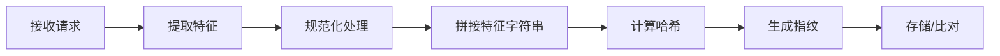

# API网关 - 请求指纹识别

## 目录
- [1. 概述](#1-概述)
- [2. 请求指纹原理](#2-请求指纹原理)
- [3. 指纹生成算法](#3-指纹生成算法)
- [4. YARP 网关实现](#4-yarp-网关实现)
- [5. Kong 网关插件](#5-kong-网关插件)
- [6. C# 中间件实现](#6-c-中间件实现)
- [7. 实战场景](#7-实战场景)
- [8. 性能优化](#8-性能优化)

---

## 1. 概述

### 1.1 什么是请求指纹？

请求指纹是基于请求的特征信息生成的唯一标识符，用于识别和去重重复请求。

**核心思想**：
```
请求特征 = HTTP方法 + URL + 查询参数 + 请求体 + 头部信息
请求指纹 = Hash(请求特征)
```

**应用场景**：
- **API 网关层去重**：在入口处拦截重复请求
- **防重放攻击**：检测并拒绝恶意重放
- **幂等性保证**：相同指纹的请求只处理一次
- **请求追踪**：基于指纹进行链路追踪

### 1.2 架构位置

```
┌──────────┐      ┌──────────────┐      ┌─────────────┐
│  Client  │─────▶│  API Gateway  │─────▶│  Backend    │
│          │      │              │      │  Services   │
│          │      │ • 指纹生成    │      │             │
│          │      │ • 重复检测    │      │             │
│          │      │ • 限流熔断    │      │             │
└──────────┘      └──────────────┘      └─────────────┘
                         │
                   ┌─────▼─────┐
                   │  Redis    │
                   │ (指纹缓存) │
                   └───────────┘
```

---

## 2. 请求指纹原理

### 2.1 指纹组成要素

| 要素 | 说明 | 示例 | 权重 |
|------|------|------|------|
| **HTTP 方法** | GET/POST/PUT/DELETE | POST | 高 |
| **URL 路径** | 请求路径 | /api/orders | 高 |
| **查询参数** | URL 参数 | ?page=1&size=10 | 中 |
| **请求体** | Body 内容 | JSON payload | 高 |
| **关键 Header** | 认证、Content-Type | Authorization | 中 |
| **客户端标识** | IP、User-Agent | 192.168.1.100 | 低 |

### 2.2 指纹生成流程



### 2.3 示例

**请求1**：
```http
POST /api/orders HTTP/1.1
Host: api.example.com
Authorization: Bearer abc123
Content-Type: application/json

{"productId": 1001, "quantity": 2}
```

**请求2**（重复）：
```http
POST /api/orders HTTP/1.1
Host: api.example.com
Authorization: Bearer abc123
Content-Type: application/json

{"productId": 1001, "quantity": 2}
```

**指纹计算**：
```
特征字符串 = "POST:/api/orders:productId=1001&quantity=2"
指纹 = SHA256(特征字符串) = "a1b2c3d4e5f6..."
```

---

## 3. 指纹生成算法

### 3.1 基础哈希算法

```csharp
using System.Security.Cryptography;
using System.Text;

namespace Idempotency.Gateway.Fingerprinting
{
    /// <summary>
    /// 请求指纹生成器
    /// </summary>
    public class RequestFingerprintGenerator
    {
        /// <summary>
        /// 生成请求指纹
        /// </summary>
        public string Generate(HttpRequest request)
        {
            // 1. 提取特征
            var method = request.Method;
            var path = request.Path.Value?.ToLowerInvariant();
            var queryString = GetNormalizedQueryString(request.Query);
            var body = GetRequestBodyAsync(request).GetAwaiter().GetResult();
            
            // 2. 拼接特征字符串
            var featureString = $"{method}:{path}:{queryString}:{body}";
            
            // 3. 计算 SHA256 哈希
            using var sha256 = SHA256.Create();
            var hashBytes = sha256.ComputeHash(Encoding.UTF8.GetBytes(featureString));
            
            // 4. 转换为十六进制字符串
            return Convert.ToHexString(hashBytes).ToLowerInvariant();
        }
        
        /// <summary>
        /// 获取规范化的查询字符串
        /// </summary>
        private string GetNormalizedQueryString(IQueryCollection query)
        {
            // 排序参数，确保顺序不影响指纹
            var sortedParams = query
                .OrderBy(kvp => kvp.Key)
                .Select(kvp => $"{kvp.Key}={kvp.Value}")
                .ToList();
            
            return string.Join("&", sortedParams);
        }
        
        /// <summary>
        /// 读取请求体
        /// </summary>
        private async Task<string> GetRequestBodyAsync(HttpRequest request)
        {
            // 启用缓冲
            request.EnableBuffering();
            
            try
            {
                using var reader = new StreamReader(
                    request.Body,
                    Encoding.UTF8,
                    detectEncodingFromByteOrderMarks: false,
                    bufferSize: 8192,
                    leaveOpen: true);
                
                var body = await reader.ReadToEndAsync();
                
                // 重置流位置
                request.Body.Position = 0;
                
                // 对于 JSON，规范化格式
                if (request.ContentType?.Contains("application/json") == true)
                {
                    body = NormalizeJson(body);
                }
                
                return body;
            }
            catch
            {
                return string.Empty;
            }
        }
        
        /// <summary>
        /// 规范化 JSON（移除空白、排序键）
        /// </summary>
        private string NormalizeJson(string json)
        {
            try
            {
                using var doc = JsonDocument.Parse(json);
                var options = new JsonWriterOptions
                {
                    Indented = false,
                    Encoder = JavaScriptEncoder.UnsafeRelaxedJsonEscaping
                };
                
                using var stream = new MemoryStream();
                using var writer = new Utf8JsonWriter(stream, options);
                
                WriteSortedJson(doc.RootElement, writer);
                writer.Flush();
                
                return Encoding.UTF8.GetString(stream.ToArray());
            }
            catch
            {
                return json;
            }
        }
        
        private void WriteSortedJson(JsonElement element, Utf8JsonWriter writer)
        {
            switch (element.ValueKind)
            {
                case JsonValueKind.Object:
                    writer.WriteStartObject();
                    foreach (var property in element.EnumerateObject()
                        .OrderBy(p => p.Name))
                    {
                        writer.WritePropertyName(property.Name);
                        WriteSortedJson(property.Value, writer);
                    }
                    writer.WriteEndObject();
                    break;
                    
                case JsonValueKind.Array:
                    writer.WriteStartArray();
                    foreach (var item in element.EnumerateArray())
                    {
                        WriteSortedJson(item, writer);
                    }
                    writer.WriteEndArray();
                    break;
                    
                default:
                    element.WriteTo(writer);
                    break;
            }
        }
    }
}
```

### 3.2 增强版：带权重的指纹

```csharp
public class WeightedFingerprintGenerator
{
    private readonly FingerprintConfig _config;
    
    public WeightedFingerprintGenerator(FingerprintConfig config)
    {
        _config = config;
    }
    
    public string Generate(HttpRequest request)
    {
        var components = new List<string>();
        
        // HTTP 方法（权重：高）
        if (_config.IncludeMethod)
        {
            components.Add($"method:{request.Method}");
        }
        
        // URL 路径（权重：高）
        if (_config.IncludePath)
        {
            components.Add($"path:{request.Path.Value?.ToLowerInvariant()}");
        }
        
        // 查询参数（权重：中）
        if (_config.IncludeQuery && request.Query.Any())
        {
            var sortedQuery = string.Join("&", 
                request.Query.OrderBy(k => k.Key)
                    .Select(k => $"{k.Key}={k.Value}"));
            components.Add($"query:{sortedQuery}");
        }
        
        // 请求体（权重：高）
        if (_config.IncludeBody && request.ContentLength > 0)
        {
            var body = ExtractBodyAsync(request).GetAwaiter().GetResult();
            components.Add($"body:{body}");
        }
        
        // 客户端 IP（权重：低）
        if (_config.IncludeClientIp)
        {
            var clientIp = request.HttpContext.Connection.RemoteIpAddress?.ToString();
            components.Add($"ip:{clientIp}");
        }
        
        // 用户标识（权重：中）
        if (_config.IncludeUserId)
        {
            var userId = request.HttpContext.User.FindFirst("sub")?.Value;
            if (userId != null)
            {
                components.Add($"user:{userId}");
            }
        }
        
        // 组合并计算哈希
        var featureString = string.Join("|", components);
        return ComputeHash(featureString);
    }
    
    private string ComputeHash(string input)
    {
        using var sha256 = SHA256.Create();
        var bytes = sha256.ComputeHash(Encoding.UTF8.GetBytes(input));
        return Convert.ToHexString(bytes).ToLowerInvariant()[..16]; // 取前16位
    }
}

public class FingerprintConfig
{
    public bool IncludeMethod { get; set; } = true;
    public bool IncludePath { get; set; } = true;
    public bool IncludeQuery { get; set; } = true;
    public bool IncludeBody { get; set; } = true;
    public bool IncludeClientIp { get; set; } = false;
    public bool IncludeUserId { get; set; } = true;
}
```

---

## 4. YARP 网关实现

### 4.1 安装 YARP

```bash
dotnet add package Yarp.ReverseProxy
```

### 4.2 配置反向代理

```json
{
  "ReverseProxy": {
    "Routes": {
      "orders-route": {
        "ClusterId": "orders-cluster",
        "Match": {
          "Path": "/api/orders/{**catch-all}"
        },
        "Transforms": [
          { "PathRemovePrefix": "/api/orders" }
        ]
      }
    },
    "Clusters": {
      "orders-cluster": {
        "Destinations": {
          "destination1": {
            "Address": "http://localhost:5001/"
          }
        }
      }
    }
  }
}
```

### 4.3 去重中间件

```csharp
using StackExchange.Redis;
using Yarp.ReverseProxy.Transforms;

namespace Idempotency.Gateway.Middleware
{
    /// <summary>
    /// 基于请求指纹的去重中间件
    /// </summary>
    public class RequestDeduplicationMiddleware
    {
        private readonly RequestDelegate _next;
        private readonly IDatabase _redis;
        private readonly RequestFingerprintGenerator _fingerprintGenerator;
        private readonly ILogger<RequestDeduplicationMiddleware> _logger;
        
        public RequestDeduplicationMiddleware(
            RequestDelegate next,
            IConnectionMultiplexer redis,
            RequestFingerprintGenerator fingerprintGenerator,
            ILogger<RequestDeduplicationMiddleware> logger)
        {
            _next = next;
            _redis = redis.GetDatabase();
            _fingerprintGenerator = fingerprintGenerator;
            _logger = logger;
        }
        
        public async Task InvokeAsync(HttpContext context)
        {
            // 1. 生成请求指纹
            var fingerprint = _fingerprintGenerator.Generate(context.Request);
            var cacheKey = $"dedup:{fingerprint}";
            
            // 2. 检查是否重复请求
            var existingResponse = await _redis.StringGetAsync(cacheKey);
            
            if (existingResponse.HasValue)
            {
                _logger.LogWarning("Duplicate request detected. Fingerprint: {Fingerprint}", fingerprint);
                
                // 3. 返回缓存的响应
                context.Response.ContentType = "application/json";
                context.Response.StatusCode = StatusCodes.Status200OK;
                await context.Response.WriteAsync(existingResponse!);
                return;
            }
            
            // 4. 捕获响应
            var originalBodyStream = context.Response.Body;
            using var responseBody = new MemoryStream();
            context.Response.Body = responseBody;
            
            try
            {
                // 5. 继续处理请求
                await _next(context);
                
                // 6. 读取响应内容
                responseBody.Seek(0, SeekOrigin.Begin);
                var responseText = await new StreamReader(responseBody).ReadToEndAsync();
                
                // 7. 缓存响应（5分钟）
                if (context.Response.StatusCode == StatusCodes.Status200OK)
                {
                    await _redis.StringSetAsync(
                        cacheKey,
                        responseText,
                        TimeSpan.FromMinutes(5));
                    
                    _logger.LogInformation("Response cached. Fingerprint: {Fingerprint}", fingerprint);
                }
                
                // 8. 写回原始响应流
                responseBody.Seek(0, SeekOrigin.Begin);
                await responseBody.CopyToAsync(originalBodyStream);
            }
            finally
            {
                context.Response.Body = originalBodyStream;
            }
        }
    }
}
```

### 4.4 注册中间件

```csharp
using Idempotency.Gateway.Middleware;

var builder = WebApplication.CreateBuilder(args);

// 添加 YARP
builder.Services.AddReverseProxy()
    .LoadFromConfig(builder.Configuration.GetSection("ReverseProxy"));

// 添加 Redis
builder.Services.AddSingleton<IConnectionMultiplexer>(sp =>
{
    var config = builder.Configuration.GetConnectionString("Redis");
    return ConnectionMultiplexer.Connect(config);
});

// 添加指纹生成器
builder.Services.AddSingleton<RequestFingerprintGenerator>();

var app = builder.Build();

// 注册去重中间件（在 YARP 之前）
app.UseMiddleware<RequestDeduplicationMiddleware>();

// 使用反向代理
app.MapReverseProxy();

app.Run();
```

---

## 5. Kong 网关插件

### 5.1 Lua 插件实现

```lua
-- /usr/local/share/lua/5.1/kong/plugins/request-deduplication/handler.lua

local redis = require "resty.redis"
local sha256 = require "resty.sha256"
local cjson = require "cjson"

local RequestDeduplicationHandler = {
    VERSION = "1.0.0",
    PRIORITY = 1000
}

function RequestDeduplicationHandler:access(conf)
    -- 生成请求指纹
    local fingerprint = self:generate_fingerprint(conf)
    
    -- 连接 Redis
    local red = redis:new()
    red:set_timeout(1000)
    
    local ok, err = red:connect(conf.redis_host, conf.redis_port)
    if not ok then
        kong.log.err("Failed to connect to Redis: ", err)
        return
    end
    
    -- 检查是否重复
    local cache_key = "dedup:" .. fingerprint
    local cached_response = red:get(cache_key)
    
    if cached_response ~= ngx.null then
        -- 返回缓存的响应
        kong.response.exit(200, cached_response, {
            ["Content-Type"] = "application/json",
            ["X-Cache-Hit"] = "true"
        })
        return
    end
    
    -- 存储指纹到上下文，供后续使用
    kong.ctx.shared.fingerprint = fingerprint
end

function RequestDeduplicationHandler:body_filter(conf)
    local chunk = ngx.arg[1]
    local eof = ngx.arg[2]
    
    if eof and kong.ctx.shared.fingerprint then
        -- 累积完整响应
        local full_response = kong.ctx.shared.body or ""
        full_response = full_response .. chunk
        
        -- 缓存成功响应
        if ngx.status == 200 then
            local red = redis:new()
            red:set_timeout(1000)
            red:connect(conf.redis_host, conf.redis_port)
            
            local cache_key = "dedup:" .. kong.ctx.shared.fingerprint
            red:setex(cache_key, conf.ttl, full_response)
        end
    end
end

function RequestDeduplicationHandler:generate_fingerprint(conf)
    local str = require "resty.string"
    
    -- 收集特征
    local method = ngx.req.get_method()
    local path = ngx.var.uri
    local args = ngx.req.get_uri_args()
    
    -- 排序参数
    local sorted_keys = {}
    for key in pairs(args) do
        table.insert(sorted_keys, key)
    end
    table.sort(sorted_keys)
    
    -- 构建特征字符串
    local parts = {method, path}
    
    for _, key in ipairs(sorted_keys) do
        table.insert(parts, key .. "=" .. tostring(args[key]))
    end
    
    -- 读取请求体
    if conf.include_body then
        local body_data = ngx.req.get_body_data()
        if body_data then
            table.insert(parts, body_data)
        end
    end
    
    local feature_string = table.concat(parts, ":")
    
    -- 计算 SHA256
    local digest = sha256:new()
    digest:update(feature_string)
    local hash = digest:final()
    
    return str.to_hex(hash):sub(1, 16)
end

return RequestDeduplicationHandler
```

### 5.2 插件配置

```yaml
# schema.lua
local typedefs = require "kong.db.schema.typedefs"

return {
    name = "request-deduplication",
    fields = {
        { consumer = typedefs.no_consumer },
        { protocols = typedefs.protocols_http },
        { config = {
            type = "record",
            fields = {
                { redis_host = { type = "string", default = "127.0.0.1" } },
                { redis_port = { type = "number", default = 6379 } },
                { ttl = { type = "number", default = 300 } },
                { include_body = { type = "boolean", default = true } },
            },
        }},
    },
}
```

---

## 6. C# 中间件实现

### 6.1 完整的 ASP.NET Core 中间件

```csharp
using Microsoft.AspNetCore.Mvc;
using StackExchange.Redis;
using System.Text.Json;

namespace Idempotency.Middleware
{
    /// <summary>
    /// 请求去重中间件
    /// </summary>
    public class AdvancedRequestDeduplicationMiddleware
    {
        private readonly RequestDelegate _next;
        private readonly IDatabase _redis;
        private readonly RequestFingerprintGenerator _fingerprintGenerator;
        private readonly DeduplicationOptions _options;
        private readonly ILogger<AdvancedRequestDeduplicationMiddleware> _logger;
        
        public AdvancedRequestDeduplicationMiddleware(
            RequestDelegate next,
            IConnectionMultiplexer redis,
            RequestFingerprintGenerator fingerprintGenerator,
            DeduplicationOptions options,
            ILogger<AdvancedRequestDeduplicationMiddleware> logger)
        {
            _next = next;
            _redis = redis.GetDatabase();
            _fingerprintGenerator = fingerprintGenerator;
            _options = options;
            _logger = logger;
        }
        
        public async Task InvokeAsync(HttpContext context)
        {
            // 只处理需要去重的请求
            if (!ShouldDeduplicate(context))
            {
                await _next(context);
                return;
            }
            
            // 生成指纹
            var fingerprint = _fingerprintGenerator.Generate(context.Request);
            var cacheKey = $"dedup:{_options.Prefix}:{fingerprint}";
            
            // 尝试获取缓存响应
            var cachedResponse = await _redis.StringGetAsync(cacheKey);
            
            if (cachedResponse.HasValue)
            {
                _logger.LogDebug("Cache hit for fingerprint {Fingerprint}", fingerprint);
                
                // 设置命中头
                context.Response.Headers["X-Cache-Hit"] = "true";
                context.Response.Headers["X-Request-Fingerprint"] = fingerprint;
                
                // 返回缓存响应
                var response = JsonSerializer.Deserialize<CachedResponse>(cachedResponse!);
                if (response != null)
                {
                    context.Response.ContentType = response.ContentType;
                    context.Response.StatusCode = response.StatusCode;
                    await context.Response.WriteAsync(response.Body);
                }
                return;
            }
            
            // 捕获响应
            var originalBodyStream = context.Response.Body;
            using var responseBody = new MemoryStream();
            context.Response.Body = responseBody;
            
            try
            {
                // 继续处理
                await _next(context);
                
                // 读取响应
                responseBody.Seek(0, SeekOrigin.Begin);
                var responseText = await new StreamReader(responseBody).ReadToEndAsync();
                
                // 缓存成功的响应
                if (IsCacheableResponse(context.Response.StatusCode))
                {
                    var cachedResponse = new CachedResponse
                    {
                        StatusCode = context.Response.StatusCode,
                        ContentType = context.Response.ContentType,
                        Body = responseText
                    };
                    
                    var json = JsonSerializer.Serialize(cachedResponse);
                    
                    await _redis.StringSetAsync(
                        cacheKey,
                        json,
                        _options.Ttl);
                    
                    _logger.LogDebug("Response cached. Fingerprint: {Fingerprint}, TTL: {Ttl}s", 
                        fingerprint, _options.Ttl.TotalSeconds);
                }
                
                // 设置指纹头
                context.Response.Headers["X-Request-Fingerprint"] = fingerprint;
                context.Response.Headers["X-Cache-Hit"] = "false";
                
                // 写回响应
                responseBody.Seek(0, SeekOrigin.Begin);
                await responseBody.CopyToAsync(originalBodyStream);
            }
            finally
            {
                context.Response.Body = originalBodyStream;
            }
        }
        
        private bool ShouldDeduplicate(HttpContext context)
        {
            // 只处理 POST/PUT 请求
            if (!_options.Methods.Contains(context.Request.Method, StringComparer.OrdinalIgnoreCase))
            {
                return false;
            }
            
            // 排除特定路径
            var path = context.Request.Path.Value?.ToLowerInvariant();
            return !_options.ExcludedPaths.Any(p => path?.StartsWith(p) == true);
        }
        
        private bool IsCacheableResponse(int statusCode)
        {
            return statusCode >= 200 && statusCode < 300;
        }
    }
    
    public class CachedResponse
    {
        public int StatusCode { get; set; }
        public string ContentType { get; set; } = "application/json";
        public string Body { get; set; } = string.Empty;
    }
    
    public class DeduplicationOptions
    {
        public string Prefix { get; set; } = "api";
        public TimeSpan Ttl { get; set; } = TimeSpan.FromMinutes(5);
        public List<string> Methods { get; set; } = new() { "POST", "PUT" };
        public List<string> ExcludedPaths { get; set; } = new() { "/auth", "/health" };
    }
}
```

### 6.2 扩展方法

```csharp
namespace Microsoft.Extensions.DependencyInjection
{
    public static class RequestDeduplicationExtensions
    {
        public static IApplicationBuilder UseRequestDeduplication(
            this IApplicationBuilder app,
            Action<DeduplicationOptions>? configureOptions = null)
        {
            var options = new DeduplicationOptions();
            configureOptions?.Invoke(options);
            
            var redis = app.ApplicationServices
                .GetRequiredService<IConnectionMultiplexer>();
            var fingerprintGenerator = app.ApplicationServices
                .GetRequiredService<RequestFingerprintGenerator>();
            var logger = app.ApplicationServices
                .GetRequiredService<ILogger<AdvancedRequestDeduplicationMiddleware>>();
            
            return app.UseMiddleware<AdvancedRequestDeduplicationMiddleware>(
                redis, fingerprintGenerator, options, logger);
        }
        
        public static IServiceCollection AddRequestDeduplication(
            this IServiceCollection services)
        {
            services.AddSingleton<RequestFingerprintGenerator>();
            return services;
        }
    }
}
```

**使用**：

```csharp
var builder = WebApplication.CreateBuilder(args);

builder.Services.AddStackExchangeRedisCache(options =>
{
    options.Configuration = builder.Configuration.GetConnectionString("Redis");
});

builder.Services.AddRequestDeduplication();

var app = builder.Build();

app.UseRequestDeduplication(options =>
{
    options.Ttl = TimeSpan.FromMinutes(10);
    options.Methods = new() { "POST" };
    options.ExcludedPaths = new() { "/webhooks" };
});

app.MapControllers();
app.Run();
```

---

## 7. 实战场景

### 7.1 防止表单重复提交

```csharp
public class FormSubmissionController
{
    [HttpPost("submit")]
    [RequestDeduplication(Ttl = 60)] // 自定义属性
    public async Task<IActionResult> SubmitForm([FromBody] FormRequest request)
    {
        // 业务逻辑
        await ProcessFormAsync(request);
        return Ok(new { success = true });
    }
}

[AttributeUsage(AttributeTargets.Method)]
public class RequestDeduplicationAttribute : Attribute
{
    public int Ttl { get; set; } = 300;
}
```

### 7.2 支付回调去重

```csharp
[HttpPost("webhook/payment")]
public async Task<IActionResult> PaymentWebhook([FromBody] PaymentCallback callback)
{
    // 基于订单号生成指纹
    var fingerprint = $"payment_{callback.OrderNo}_{callback.TransactionId}";
    
    // 检查是否已处理
    var processed = await _redis.StringGetAsync($"webhook:{fingerprint}");
    if (processed.HasValue)
    {
        return Ok(new { code = "SUCCESS", message = "Already processed" });
    }
    
    // 处理回调
    await ProcessPaymentCallbackAsync(callback);
    
    // 标记已处理
    await _redis.StringSetAsync($"webhook:{fingerprint}", "1", TimeSpan.FromHours(24));
    
    return Ok(new { code = "SUCCESS" });
}
```

### 7.3 批量导入去重

```csharp
[HttpPost("import")]
public async Task<IActionResult> BulkImport([FromBody] List<ImportItem> items)
{
    var fingerprints = items.Select(item => 
        $"import:{item.Sku}:{item.WarehouseId}").ToList();
    
    // 批量检查
    var existingItems = await _redis.StringGetAsync(
        fingerprints.Select(f => new RedisKey(f)).ToArray());
    
    var newItems = new List<ImportItem>();
    for (int i = 0; i < items.Count; i++)
    {
        if (!existingItems[i].HasValue)
        {
            newItems.Add(items[i]);
        }
    }
    
    // 处理新项
    await ImportItemsAsync(newItems);
    
    // 标记已处理
    foreach (var fingerprint in fingerprints)
    {
        await _redis.StringSetAsync(fingerprint, "1", TimeSpan.FromHours(1));
    }
    
    return Ok(new { 
        total = items.Count,
        imported = newItems.Count,
        skipped = items.Count - newItems.Count
    });
}
```

---

## 8. 性能优化

### 8.1 布隆过滤器（减少 Redis 查询）

```csharp
using BloomFilter;

public class BloomFilterDeduplicationMiddleware
{
    private readonly IBloomFilter<string> _bloomFilter;
    private readonly IDatabase _redis;
    
    public BloomFilterDeduplicationMiddleware(
        IBloomFilter<string> bloomFilter,
        IDatabase redis)
    {
        _bloomFilter = bloomFilter;
        _redis = redis;
    }
    
    public async Task<bool> IsDuplicateAsync(string fingerprint)
    {
        // 布隆过滤器快速判断
        if (!_bloomFilter.MightContain(fingerprint))
        {
            // 肯定不存在
            return false;
        }
        
        // 可能存在，查 Redis 确认
        var exists = await _redis.KeyExistsAsync($"dedup:{fingerprint}");
        return exists;
    }
    
    public async Task MarkAsProcessedAsync(string fingerprint)
    {
        _bloomFilter.Add(fingerprint);
        await _redis.StringSetAsync($"dedup:{fingerprint}", "1", TimeSpan.FromMinutes(5));
    }
}
```

### 8.2 本地缓存 + Redis

```csharp
public class TwoLevelCacheDeduplication
{
    private readonly IMemoryCache _localCache;
    private readonly IDatabase _redis;
    
    public async Task<bool> IsDuplicateAsync(string fingerprint)
    {
        // L1: 本地缓存
        if (_localCache.TryGetValue(fingerprint, out _))
        {
            return true;
        }
        
        // L2: Redis
        var exists = await _redis.KeyExistsAsync($"dedup:{fingerprint}");
        
        if (exists)
        {
            // 回填本地缓存
            _localCache.Set(fingerprint, true, TimeSpan.FromSeconds(30));
        }
        
        return exists;
    }
}
```

### 8.3 异步批量写入

```csharp
public class BatchCacheWriter : BackgroundService
{
    private readonly Channel<CacheEntry> _channel;
    private readonly IDatabase _redis;
    
    protected override async Task ExecuteAsync(CancellationToken stoppingToken)
    {
        var batch = new List<CacheEntry>();
        
        while (!stoppingToken.IsCancellationRequested)
        {
            // 收集批次
            while (batch.Count < 100 && _channel.Reader.TryRead(out var entry))
            {
                batch.Add(entry);
            }
            
            if (batch.Any())
            {
                // 批量写入
                var tasks = batch.Select(e => 
                    _redis.StringSetAsync(
                        $"dedup:{e.Fingerprint}", 
                        e.Response, 
                        e.Ttl));
                
                await Task.WhenAll(tasks);
                batch.Clear();
            }
            
            await Task.Delay(TimeSpan.FromMilliseconds(100), stoppingToken);
        }
    }
}
```

---

## 总结

请求指纹识别是 API 网关层实现幂等性的关键技术：

### 核心要点

1. **指纹生成**：基于方法、路径、参数、请求体生成唯一标识
2. **存储策略**：Redis 缓存响应，设置合理 TTL
3. **网关集成**：YARP、Kong 等网关均可实现
4. **性能优化**：布隆过滤器、多级缓存、批量写入

### 最佳实践

- **细粒度控制**：针对不同 API 配置不同的去重策略
- **快速失败**：重复请求直接返回缓存，减少后端压力
- **监控告警**：记录去重命中率，异常时告警
- **渐进式部署**：先日志观察，再开启实际去重

通过 API 网关层的指纹识别，可以在系统入口处拦截大量重复请求，显著提升系统性能和稳定性。
